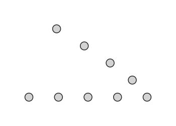

---
---

<!-- 
:material-star: *Follow along in a jupyter notebook on binder:*
[:material-notebook: Node-class.ipynb](https://mybinder.org/v2/gh/eaton-lab/phylogenetic-data-science/HEAD?filepath=docs%2Fchapter-1%2Fnotebooks%2Fcode-tree-traversal.ipynb) -->

# IN DEVELOPMENT

## Learning objectives
The goal of this chapter is to introduce the concept of tree traversals.
By the end of this chapter you will:

1. Understand how traversal over connected Nodes is useful for working with trees.
2. Be familiar with different tree traversal algorithms.
4. Practice writing tree traversal functions using iterators and recursion.


## Chapter goals
A key feature of tree data structures is the process of traversal, by which each
Node is visited in some determined order. Traversal algorithms make it
possible to calculate information on trees fast and efficiently, typically
by performing calculations on parts of the tree which can be used for later
calculations. Examples of this include *Felsenstein's pruning algorithm*,
which we will cover later, as an efficient traversal algorithm for calculating
parsimony or likelihood scores on trees (citation). Here we will first cover
several more simple examples, showing how different traversal algorithms
visit Nodes in different orders, and why this is useful for different types
of operations.

## Node class
We will reuse the simple Node class object that we developed in the last
chapter. As a reminder, an instance of this class represents a single Node,
but by creating multiple Nodes that include references to each other, the
collection of Nodes can represent a tree data structure.

??? Example "Node class definition"

    ```py
    from typing import Tuple, Optional

    class Node:
        """A Node instance that can connect with other Nodes to form a Tree.

        Parameters
        ----------
        name: str
            A name string associated with a Node when printed or visualized.
        dist: float
            A float value as the distance between this Node and its parent (up)

        Attributes
        ----------
        children: Tuple
            A tuple of Node instances that are descended from this Node.
        up: Node or None
            A Node that is ancestral to this Node, or None if this Node is root.

        Examples
        --------
        >>> node = Node("A")
        >>> node.add_child("B")
        >>> print(node.name, node.children)
        """
        def __init__(self, name: str="", dist: float=0.):
            self.name = str(name)
            self.dist = float(dist)
            self.children: Tuple['Node'] = ()
            self.up: Optional['Node'] = None

        def __repr__(self) -> str:
            """Return string representation as Node(name)."""
            return f"Node({self.name})"

        def is_leaf(self) -> bool:
            """Return True if Node is a leaf (i.e., has no children)."""
            return not bool(self.children)

        def is_root(self) -> bool:
            """Return True if Node is the root (i.e., has no ancestor)."""
            return bool(self.up is None)

        def add_child(self, name: str="", dist: float=0.) -> "Node":
            """Add a Node as a child to this one."""
            new_node = Node(name=name, dist=dist)
            new_node.up = self
            self.children += (new_node,)
            return new_node
    ```
```py
# example: create a tree of connected Node class instances
node_a = Node("A")
node_a.add_child("B")
node_a.add_child("C")
print(node_a, node_a.children)
```
```py
# Node(A) (Node(B), Node(C))
```

## Generating Trees
So far we have worked with just a few connected Nodes at a time, but we
want to also be able to work with a tree composed of many connected Nodes.
So let's create a function that can connect many Nodes together automatically.
This function, `get_random_tree`, will build a tree by repeatedly creating
bifurcations by selecting a tip Node at random (starting with just a single
root Node) and adding two child Nodes until the desired number of tip Nodes 
exist. 

??? Example "get_random_tree function definition"
    ```py
    from typing import Optional
    import random

    def get_random_tree(ntips: int, seed: Optional[int] = None) -> "Node":
        """Return a ladder-like tree of Node objects with 'ntips' tip Nodes.

        Parameters
        ----------
        ntips: int
            The number of tip Nodes that must exist before the tree is returned.

        Returns
        -------
        Node
            The root Node of the set of connected Nodes is returned.
        """
        # set random seed
        random.seed(seed)
        
        # create root Node with name=root
        root = Node(name="root", dist=0)
        
        # store Nodes in a list that are currently tips
        tips = [root]

        # add tip Nodes by splitting 'node' into a bifurcation until ntips exist.
        for idx in range(1, ntips):
            
            # randomly sample one of the current tip Nodes
            node = random.choice(tips)
            tips.remove(node)
            
            # create two new tips from 'node' and add to tips list  
            child_l = node.add_child(name=f"left{idx}", dist=1)
            child_r = node.add_child(name=f"right{idx}", dist=1)
            tips.extend([child_l, child_r])

        # return root Node that now has ntips descended tip Nodes
        return root
    ```

```py
# example: create a tree of connected Node class instances
root_node = get_random_tree(ntips=5, seed=123)
print(root_node)
```
```py
# Node(root)
```

Using this function we can now create a tree, like above. This example has 
10 tip Nodes, and because it is fully bifurcating, it has 19 total Nodes 
(2 * ntips - 1). We could now interact with the collection of Nodes in this 
tree in a number of ways. For example, we might create a list that includes 
all of the Nodes, or a dict that maps Node names to the Node instances. But 
either of those approaches would essentially linearize the Node collection, 
rather than treating it hierarchically. Instead, our function above has 
returned just one Node instance, the root, as a representation of the entire 
tree. This approach works because we know that every Node is connected to 
some other Node by its pointers, and thus it is possible to visit all Nodes 
by moving down through the hierarchy of children descended from the root 
(i.e., using a tree traversal). 


## Coding traversal algorithms
A traversal algorithm represents a set of rules for consistently iterating
over Nodes in a tree to visit each Node exactly once. There are several
common traversal algorithms which we will cover shortly. The first that 
we will code below is called *preorder* traversal, which starts at the root
and visits Nodes by proceeding down the left and then right subtrees of each
Node (more on this in a bit).

Coding traversal algorithms is an interesting computational exercise, and
is thus often included as part of an introductory computer science course. 
There are two efficient methods for coding tree traversals: 
*recursion* and *iteration*. These two approaches produce identical outcomes,
and are identical in their speed and memory usage. Thus, the decision to 
implement one approach versus the other boils down to preference by the 
developer. Personally, I tend to prefer iterators in most circumstances. 
Both approaches can be very elegant in their simplicity, but I find iteration
to be easier to read and comprehend than recursion. Below I introduce 
both approaches, but we will focus more on the use of iteration afterwards.

### Traversal by recursion
A recursive function is a function that calls itself internally. This approach
is well suited for the Node class object that we have created, since, for 
example, we can write a function that takes a Node as input and then calls
the same function again on the Nodes children (or parent, depending on the
directin of recursion) until there are no more Nodes to operate on. In this
way the function reaches every Node in a very simple and elegant way. 

Below is a function called `traverse_preorder_by_recursion` that takes a 
Node as input and returns an ordered list of Nodes as a result. The returned
list represents the order in which Nodes were visited. To understand how
this Node works read it from top to bottom thinking about what would happen
if it is called on a Node that is a leaf, versus a Node that is not a leaf.
In the case below, we first call it on the root Node (not a leaf), so it
skips the first part of the function, and runs the second part. In the second
part, it creates a list containing the current Node (root), and then adds to
it the result of calling the `traverse_preorder_by_recursion` function on 
each of its child Nodes. So we need to think about what would be returned
by this function when it is called on those Nodes. Well, if the Node is a 
leaf then it would return the child Node as a list (i.e., it runs the 
first part of the function); if the Node is not a leaf, however, then it 
would do the same thing that happened when it was run on the root, it 
continues recursively to call the same function on its own children until
it is called on a child Node. This is the *recursion*. Consequently, the 
results from the leaf Nodes are bubbled up until the children of the root
Node is a list of Nodes, which is returned as the result.

If that was confusing, I totally understand. Recursive functions can take
time to understand. Try inserting a print statement into the function to 
print information during each step of the process to better understand what
is going on.

```py
def traverse_preorder_by_recursion(node) -> List['Node']:
    """Return a list of Nodes in 'preorder' traversal order."""

    # Node is a leaf: return the Node
    if not node.children:
        return [node]

    # Node is not leaf: return this Node + func called on each child.
    nodes = [node]
    for child in node.children:
        nodes.extend(traverse_preorder_by_recursion(child))
    return nodes
```

```py
# example: print the preorder traversal order
print(traverse_preorder_by_recursion(root_node))
```
```py
# [Node(root), Node(left1), Node(left3), Node(right3), Node(left4), Node(right4), Node(right1), Node(left2), Node(right2)]
```

### Traversal by iteration
Iteration is the process of repetitively executing a process, such as with 
a for-loop. Because this is such a common practice in computation, Python
provides a number of ways to iterate over data structures. One particularly
useful method is the use of *generators*, which are functions that behave
like an iterator. This means that instead of computing the entire collection
of values in an iterable object before returning it, it instead *generates
only the next value at a time and return it when it is requested*. This has
a number of advantages. First, it reduces the number of values that need to
be stored in memory; second, it is possible to stop the iteration when a 
desired value is reached before the end; and third, it can be used to write
simpler and more understandable code.

Once you understand generators, using them is quite easy. They are like 
a normal function but instead of using the `return` expression you instead
use `yield`. Whereas a function completely stops when `return` is called, 
`yield` instead returns the current value and then sits idle, able to continue
from where it left off *inside the function* when the next value is requested.
Below is an example generator function to iterate over Node objects in 
preorder traversal order. We will discuss this example in more detail in a 
little bit.

```py
from typing import Iterator, List

def traverse_preorder_by_iteration(node) -> Iterator['Node']:
    """Yield Nodes in 'preorder' traversal order."""
    queue = [node]
    while queue:
        node = queue.pop()
        yield node
        queue.extend(node.children[::-1])
```

```py
# example: print the preorder traversal order
print(traverse_preorder_by_iteration(root_node))
```
```py
# <generator object traverse_preorder_by_iteration at 0x7f0166e91660>
```

The first thing you will notice when you call a generator function is that
it does not show the contents of the generator, in contrast to the recursive
function above which returned a list. *This is because the contents of the 
generator have not been created yet*: you need to iterate over it, where upon
the values will be generated. This could be done with a for-loop, or, a simple
shortcut is to call the `list` function to convert it to a list. As you can 
see below, this returns a list that is the same order of Nodes as returned by 
the recursive function above.

```py
# example: print the preorder traversal order
print(list(traverse_preorder_by_iteration(root_node)))
```
```py
# [Node(root), Node(left1), Node(left3), Node(right3), Node(left4), Node(right4), Node(right1), Node(left2), Node(right2)]
```

<!-- 
## Why Traversals are Useful
Now that you have seen two ways to code a traversal function, let's revisit
why this is a useful process in the first place. 

Before we dive deeper into understanding how to code traversal algorithms
let's explore some examples where they are useful, by using either of our
traversal algorithms from above. A preorder traversal ...
 -->

<!-- 
??? Example "Visualize tree"
    ```py
    # generate a random 8 tip ultrametric tree
    tree = toytree.rtree.imbtree(ntips=5)

    # draw facing downw with node index labels shown
    tree.draw(ts='s', layout='d', node_labels=False, node_sizes=16, tip_labels=False);
    ```

<figure markdown>
  {width="400", loading=lazy}
</figure>
 -->


## Traversal strategies
The purpose of a tree traversal is to visit each Node in a specific order 
exactly once. *Because from any given Node there is more than one possible 
next node, an algorithm must be used to consistently follow the same set of 
rules for selecting the next node*, regardless of the tree size or shape.
Below you can find a description and animation demonstrating the order in 
which nodes are visited under several common traversal algorithms. 

??? Example "A function to draw animated trees using toyplot and toytree"
    ```py
    import toyplot
    import toytree

    # This animation code is a bit advanced, so don't worry if you do 
    # fully understand it at this point. It is included here simply for
    # reference in case it is of interest.

    def plot_traversal_order(tree: toytree.ToyTree, strategy: str="postorder") -> toyplot.canvas.Canvas
        """Return an animated toyplot canvas showing a traversal order.

        Parameters
        ----------
        tree: ToyTree
            A ToyTree class instance that will be drawn and animated.
        strategy: str
            The name of a traversal strategy supported by ToyTree.traverse().
        """
        # draw the ToyTree with nodes colored
        canvas, axes, mark = tree.draw(layout='d', tip_labels=False)
        canvas.text(canvas.width / 2, 20, f'"{strategy}" traversal', style={"font-size": "16px"})
        canvas.style["background-color"] = "white"

        # get node coordinates table
        coords = tree.get_node_coordinates(layout='d')

        # get node indices in specified traversal order
        nidxs = [i.idx for i in tree.traverse(strategy)]

        # create labeled markers in traversal order
        markers = [toyplot.marker.create(shape="o", label=str(idx)) for idx, nidx in enumerate(nidxs)]

        # get scatterplot Mark
        mark = axes.scatterplot(coords.x[nidxs], coords.y[nidxs], size=20, marker=markers)

        # iterate over each datum as a frame at 2 frames / second
        for frame in canvas.frames((coords.shape[0] + 1, 2)):

            # set opacity very low on all Nodes initially
            if frame.number == 0:
                for i in range(coords.shape[0]):
                    frame.set_datum_style(mark, 0, i, style={"opacity":0.1})

            # increase opacity as each frame 
            else:
                frame.set_datum_style(mark, 0, frame.number - 1, style={"opacity":1.0})
        return canvas


    # Example: generate random tree and plot "levelorder" traversal strategy.
    tree = toytree.rtree.unittree(ntips=8, seed=123)
    for strategy in ["levelorder", "postorder", "preorder", "idxorder"]:
        canvas = plot_traversal_order(tree, strategy)
        toyplot.html.render(canvas, f"traversal-{strategy}-animated.html", style={"text-align": "center"})
    ```


<!-- 
##############################################################################
##############################################################################
##############################################################################
##############################################################################
##############################################################################
##############################################################################
##############################################################################
##############################################################################
##############################################################################
##############################################################################
##############################################################################
##############################################################################
##############################################################################
##############################################################################
##############################################################################
##############################################################################
##############################################################################
##############################################################################
 -->


#### *levelorder* traversal
A *levelorder* traversal (also called a breadth-first search BFS) is an 
algorithm that starts at the root and visits all Nodes at a given depth
descended from the root before moving to the next level. The Nodes in each
level are visited in left to right order in `toytree`, but the opposite
could just as easily be implemented. 
The primary utility of this traversal strategy is that it is topologically 
sorted, such that a parent is always visited before any of its children.


<div class="toyplot" id="t441d115920fb4cd49438049fde184d4b" style="text-align:center"><svg class="toyplot-canvas-Canvas" xmlns:toyplot="http://www.sandia.gov/toyplot" xmlns:xlink="http://www.w3.org/1999/xlink" xmlns="http://www.w3.org/2000/svg" width="350.0px" height="250.0px" viewBox="0 0 350.0 250.0" preserveAspectRatio="xMidYMid meet" style="background-color:white;border-color:#292724;border-style:none;border-width:1.0;fill:rgb(16.1%,15.3%,14.1%);fill-opacity:1.0;font-family:Helvetica;font-size:12px;opacity:1.0;stroke:rgb(16.1%,15.3%,14.1%);stroke-opacity:1.0;stroke-width:1.0" id="te41e50b4ea13478e83d44cfe26ac8365"><g class="toyplot-coordinates-Cartesian" id="t78ea1be739cc4f4bb433a08ddd426fb0"><clipPath id="t15972abfa37b477fb7a916a814804d70"><rect x="35.0" y="35.0" width="280.0" height="180.0"></rect></clipPath><g clip-path="url(#t15972abfa37b477fb7a916a814804d70)"><g class="toytree-mark-Toytree" id="t5ca8dd1d09224e22a59ffde6b354af30"><g class="toytree-Edges" style="fill:none;stroke:rgba(16.1%,15.3%,14.1%,1.000);stroke-linecap:round;stroke-width:2.0"><path d="M 67.9 162.5 L 50.0 162.5 L 50.0 200.0" id="8,0" style="stroke-width:nan"></path><path d="M 67.9 162.5 L 85.7 162.5 L 85.7 200.0" id="8,1" style="stroke-width:nan"></path><path d="M 139.3 162.5 L 121.4 162.5 L 121.4 200.0" id="9,2" style="stroke-width:nan"></path><path d="M 139.3 162.5 L 157.1 162.5 L 157.1 200.0" id="9,3" style="stroke-width:nan"></path><path d="M 210.7 125.0 L 192.9 125.0 L 192.9 200.0" id="11,4" style="stroke-width:nan"></path><path d="M 210.7 125.0 L 228.6 125.0 L 228.6 200.0" id="11,5" style="stroke-width:nan"></path><path d="M 282.1 87.5 L 264.3 87.5 L 264.3 200.0" id="13,6" style="stroke-width:nan"></path><path d="M 282.1 87.5 L 300.0 87.5 L 300.0 200.0" id="13,7" style="stroke-width:nan"></path><path d="M 103.6 125.0 L 67.9 125.0 L 67.9 162.5" id="10,8" style="stroke-width:nan"></path><path d="M 103.6 125.0 L 139.3 125.0 L 139.3 162.5" id="10,9" style="stroke-width:nan"></path><path d="M 157.1 87.5 L 103.6 87.5 L 103.6 125.0" id="12,10" style="stroke-width:nan"></path><path d="M 157.1 87.5 L 210.7 87.5 L 210.7 125.0" id="12,11" style="stroke-width:nan"></path><path d="M 219.6 50.0 L 157.1 50.0 L 157.1 87.5" id="14,12" style="stroke-width:nan"></path><path d="M 219.6 50.0 L 282.1 50.0 L 282.1 87.5" id="14,13" style="stroke-width:nan"></path></g></g><g class="toyplot-mark-Point" id="t4e259691fde1461c81483298e47b5c8d"><g class="toyplot-Series"><g style="fill:rgb(40%,76.1%,64.7%);fill-opacity:1.0;opacity:1.0;stroke:rgb(40%,76.1%,64.7%);stroke-opacity:1.0" class="toyplot-Datum" transform="translate(219.64285714285717, 50.0)"><circle r="10.0"></circle><g><text x="-4.170000000000001" y="3.8324999999999996" style="fill:rgb(16.1%,15.3%,14.1%);fill-opacity:1.0;font-family:helvetica;font-size:15.0px;font-weight:normal;stroke:none;vertical-align:baseline;white-space:pre">0</text></g></g><g style="fill:rgb(40%,76.1%,64.7%);fill-opacity:1.0;opacity:1.0;stroke:rgb(40%,76.1%,64.7%);stroke-opacity:1.0" class="toyplot-Datum" transform="translate(157.1428571428571, 87.5)"><circle r="10.0"></circle><g><text x="-4.170000000000001" y="3.8324999999999996" style="fill:rgb(16.1%,15.3%,14.1%);fill-opacity:1.0;font-family:helvetica;font-size:15.0px;font-weight:normal;stroke:none;vertical-align:baseline;white-space:pre">1</text></g></g><g style="fill:rgb(40%,76.1%,64.7%);fill-opacity:1.0;opacity:1.0;stroke:rgb(40%,76.1%,64.7%);stroke-opacity:1.0" class="toyplot-Datum" transform="translate(282.1428571428571, 87.5)"><circle r="10.0"></circle><g><text x="-4.170000000000001" y="3.8324999999999996" style="fill:rgb(16.1%,15.3%,14.1%);fill-opacity:1.0;font-family:helvetica;font-size:15.0px;font-weight:normal;stroke:none;vertical-align:baseline;white-space:pre">2</text></g></g><g style="fill:rgb(40%,76.1%,64.7%);fill-opacity:1.0;opacity:1.0;stroke:rgb(40%,76.1%,64.7%);stroke-opacity:1.0" class="toyplot-Datum" transform="translate(103.57142857142856, 125.0)"><circle r="10.0"></circle><g><text x="-4.170000000000001" y="3.8324999999999996" style="fill:rgb(16.1%,15.3%,14.1%);fill-opacity:1.0;font-family:helvetica;font-size:15.0px;font-weight:normal;stroke:none;vertical-align:baseline;white-space:pre">3</text></g></g><g style="fill:rgb(40%,76.1%,64.7%);fill-opacity:1.0;opacity:1.0;stroke:rgb(40%,76.1%,64.7%);stroke-opacity:1.0" class="toyplot-Datum" transform="translate(210.71428571428572, 125.0)"><circle r="10.0"></circle><g><text x="-4.170000000000001" y="3.8324999999999996" style="fill:rgb(16.1%,15.3%,14.1%);fill-opacity:1.0;font-family:helvetica;font-size:15.0px;font-weight:normal;stroke:none;vertical-align:baseline;white-space:pre">4</text></g></g><g style="fill:rgb(40%,76.1%,64.7%);fill-opacity:1.0;opacity:1.0;stroke:rgb(40%,76.1%,64.7%);stroke-opacity:1.0" class="toyplot-Datum" transform="translate(264.2857142857143, 200.0)"><circle r="10.0"></circle><g><text x="-4.170000000000001" y="3.8324999999999996" style="fill:rgb(16.1%,15.3%,14.1%);fill-opacity:1.0;font-family:helvetica;font-size:15.0px;font-weight:normal;stroke:none;vertical-align:baseline;white-space:pre">5</text></g></g><g style="fill:rgb(40%,76.1%,64.7%);fill-opacity:1.0;opacity:1.0;stroke:rgb(40%,76.1%,64.7%);stroke-opacity:1.0" class="toyplot-Datum" transform="translate(300.0, 200.0)"><circle r="10.0"></circle><g><text x="-4.170000000000001" y="3.8324999999999996" style="fill:rgb(16.1%,15.3%,14.1%);fill-opacity:1.0;font-family:helvetica;font-size:15.0px;font-weight:normal;stroke:none;vertical-align:baseline;white-space:pre">6</text></g></g><g style="fill:rgb(40%,76.1%,64.7%);fill-opacity:1.0;opacity:1.0;stroke:rgb(40%,76.1%,64.7%);stroke-opacity:1.0" class="toyplot-Datum" transform="translate(67.85714285714286, 162.5)"><circle r="10.0"></circle><g><text x="-4.170000000000001" y="3.8324999999999996" style="fill:rgb(16.1%,15.3%,14.1%);fill-opacity:1.0;font-family:helvetica;font-size:15.0px;font-weight:normal;stroke:none;vertical-align:baseline;white-space:pre">7</text></g></g><g style="fill:rgb(40%,76.1%,64.7%);fill-opacity:1.0;opacity:1.0;stroke:rgb(40%,76.1%,64.7%);stroke-opacity:1.0" class="toyplot-Datum" transform="translate(139.28571428571428, 162.5)"><circle r="10.0"></circle><g><text x="-4.170000000000001" y="3.8324999999999996" style="fill:rgb(16.1%,15.3%,14.1%);fill-opacity:1.0;font-family:helvetica;font-size:15.0px;font-weight:normal;stroke:none;vertical-align:baseline;white-space:pre">8</text></g></g><g style="fill:rgb(40%,76.1%,64.7%);fill-opacity:1.0;opacity:1.0;stroke:rgb(40%,76.1%,64.7%);stroke-opacity:1.0" class="toyplot-Datum" transform="translate(192.85714285714283, 200.0)"><circle r="10.0"></circle><g><text x="-4.170000000000001" y="3.8324999999999996" style="fill:rgb(16.1%,15.3%,14.1%);fill-opacity:1.0;font-family:helvetica;font-size:15.0px;font-weight:normal;stroke:none;vertical-align:baseline;white-space:pre">9</text></g></g><g style="fill:rgb(40%,76.1%,64.7%);fill-opacity:1.0;opacity:1.0;stroke:rgb(40%,76.1%,64.7%);stroke-opacity:1.0" class="toyplot-Datum" transform="translate(228.57142857142856, 200.0)"><circle r="10.0"></circle><g><text x="-8.340000000000002" y="3.8324999999999996" style="fill:rgb(16.1%,15.3%,14.1%);fill-opacity:1.0;font-family:helvetica;font-size:15.0px;font-weight:normal;stroke:none;vertical-align:baseline;white-space:pre">10</text></g></g><g style="fill:rgb(40%,76.1%,64.7%);fill-opacity:1.0;opacity:1.0;stroke:rgb(40%,76.1%,64.7%);stroke-opacity:1.0" class="toyplot-Datum" transform="translate(50.0, 200.0)"><circle r="10.0"></circle><g><text x="-8.340000000000002" y="3.8324999999999996" style="fill:rgb(16.1%,15.3%,14.1%);fill-opacity:1.0;font-family:helvetica;font-size:15.0px;font-weight:normal;stroke:none;vertical-align:baseline;white-space:pre">11</text></g></g><g style="fill:rgb(40%,76.1%,64.7%);fill-opacity:1.0;opacity:1.0;stroke:rgb(40%,76.1%,64.7%);stroke-opacity:1.0" class="toyplot-Datum" transform="translate(85.71428571428572, 200.0)"><circle r="10.0"></circle><g><text x="-8.340000000000002" y="3.8324999999999996" style="fill:rgb(16.1%,15.3%,14.1%);fill-opacity:1.0;font-family:helvetica;font-size:15.0px;font-weight:normal;stroke:none;vertical-align:baseline;white-space:pre">12</text></g></g><g style="fill:rgb(40%,76.1%,64.7%);fill-opacity:1.0;opacity:1.0;stroke:rgb(40%,76.1%,64.7%);stroke-opacity:1.0" class="toyplot-Datum" transform="translate(121.42857142857142, 200.0)"><circle r="10.0"></circle><g><text x="-8.340000000000002" y="3.8324999999999996" style="fill:rgb(16.1%,15.3%,14.1%);fill-opacity:1.0;font-family:helvetica;font-size:15.0px;font-weight:normal;stroke:none;vertical-align:baseline;white-space:pre">13</text></g></g><g style="fill:rgb(40%,76.1%,64.7%);fill-opacity:1.0;opacity:1.0;stroke:rgb(40%,76.1%,64.7%);stroke-opacity:1.0" class="toyplot-Datum" transform="translate(157.1428571428571, 200.0)"><circle r="10.0"></circle><g><text x="-8.340000000000002" y="3.8324999999999996" style="fill:rgb(16.1%,15.3%,14.1%);fill-opacity:1.0;font-family:helvetica;font-size:15.0px;font-weight:normal;stroke:none;vertical-align:baseline;white-space:pre">14</text></g></g></g></g></g></g><g class="toyplot-mark-Text" id="t4cdf235e3ebe415692ecafc7df06d6fd"><g class="toyplot-Series"><g class="toyplot-Datum" transform="translate(175.0,20.0)"><text x="-73.696" y="4.087999999999999" style="fill:rgb(16.1%,15.3%,14.1%);fill-opacity:1.0;font-family:helvetica;font-size:16.0px;font-weight:normal;opacity:1;stroke:none;vertical-align:baseline;white-space:pre">"levelorder" traversal</text></g></g></g></svg><div class="toyplot-behavior"><script>(function()
{
var modules={};
modules["toyplot/tables"] = (function()
    {
        var tables = [];

        var module = {};

        module.set = function(owner, key, names, columns)
        {
            tables.push({owner: owner, key: key, names: names, columns: columns});
        }

        module.get = function(owner, key)
        {
            for(var i = 0; i != tables.length; ++i)
            {
                var table = tables[i];
                if(table.owner != owner)
                    continue;
                if(table.key != key)
                    continue;
                return {names: table.names, columns: table.columns};
            }
        }

        module.get_csv = function(owner, key)
        {
            var table = module.get(owner, key);
            if(table != undefined)
            {
                var csv = "";
                csv += table.names.join(",") + "\n";
                for(var i = 0; i != table.columns[0].length; ++i)
                {
                  for(var j = 0; j != table.columns.length; ++j)
                  {
                    if(j)
                      csv += ",";
                    csv += table.columns[j][i];
                  }
                  csv += "\n";
                }
                return csv;
            }
        }

        return module;
    })();
modules["toyplot/root/id"] = "t441d115920fb4cd49438049fde184d4b";
modules["toyplot/root"] = (function(root_id)
    {
        return document.querySelector("#" + root_id);
    })(modules["toyplot/root/id"]);
modules["toyplot/canvas/id"] = "te41e50b4ea13478e83d44cfe26ac8365";
modules["toyplot/canvas"] = (function(canvas_id)
    {
        return document.querySelector("#" + canvas_id);
    })(modules["toyplot/canvas/id"]);
modules["toyplot/menus/context"] = (function(root, canvas)
    {
        var wrapper = document.createElement("div");
        wrapper.innerHTML = "<ul class='toyplot-context-menu' style='background:#eee; border:1px solid #b8b8b8; border-radius:5px; box-shadow: 0px 0px 8px rgba(0%,0%,0%,0.25); margin:0; padding:3px 0; position:fixed; visibility:hidden;'></ul>"
        var menu = wrapper.firstChild;

        root.appendChild(menu);

        var items = [];

        var ignore_mouseup = null;
        function open_menu(e)
        {
            var show_menu = false;
            for(var index=0; index != items.length; ++index)
            {
                var item = items[index];
                if(item.show(e))
                {
                    item.item.style.display = "block";
                    show_menu = true;
                }
                else
                {
                    item.item.style.display = "none";
                }
            }

            if(show_menu)
            {
                ignore_mouseup = true;
                menu.style.left = (e.clientX + 1) + "px";
                menu.style.top = (e.clientY - 5) + "px";
                menu.style.visibility = "visible";
                e.stopPropagation();
                e.preventDefault();
            }
        }

        function close_menu()
        {
            menu.style.visibility = "hidden";
        }

        function contextmenu(e)
        {
            open_menu(e);
        }

        function mousemove(e)
        {
            ignore_mouseup = false;
        }

        function mouseup(e)
        {
            if(ignore_mouseup)
            {
                ignore_mouseup = false;
                return;
            }
            close_menu();
        }

        function keydown(e)
        {
            if(e.key == "Escape" || e.key == "Esc" || e.keyCode == 27)
            {
                close_menu();
            }
        }

        canvas.addEventListener("contextmenu", contextmenu);
        canvas.addEventListener("mousemove", mousemove);
        document.addEventListener("mouseup", mouseup);
        document.addEventListener("keydown", keydown);

        var module = {};
        module.add_item = function(label, show, activate)
        {
            var wrapper = document.createElement("div");
            wrapper.innerHTML = "<li class='toyplot-context-menu-item' style='background:#eee; color:#333; padding:2px 20px; list-style:none; margin:0; text-align:left;'>" + label + "</li>"
            var item = wrapper.firstChild;

            items.push({item: item, show: show});

            function mouseover()
            {
                this.style.background = "steelblue";
                this.style.color = "white";
            }

            function mouseout()
            {
                this.style.background = "#eee";
                this.style.color = "#333";
            }

            function choose_item(e)
            {
                close_menu();
                activate();

                e.stopPropagation();
                e.preventDefault();
            }

            item.addEventListener("mouseover", mouseover);
            item.addEventListener("mouseout", mouseout);
            item.addEventListener("mouseup", choose_item);
            item.addEventListener("contextmenu", choose_item);

            menu.appendChild(item);
        };
        return module;
    })(modules["toyplot/root"],modules["toyplot/canvas"]);
modules["toyplot/io"] = (function()
    {
        var module = {};
        module.save_file = function(mime_type, charset, data, filename)
        {
            var uri = "data:" + mime_type + ";charset=" + charset + "," + data;
            uri = encodeURI(uri);

            var link = document.createElement("a");
            if(typeof link.download != "undefined")
            {
              link.href = uri;
              link.style = "visibility:hidden";
              link.download = filename;

              document.body.appendChild(link);
              link.click();
              document.body.removeChild(link);
            }
            else
            {
              window.open(uri);
            }
        };
        return module;
    })();
(function(tables, context_menu, io, owner_id, key, label, names, columns, filename)
        {
            tables.set(owner_id, key, names, columns);

            var owner = document.querySelector("#" + owner_id);
            function show_item(e)
            {
                return owner.contains(e.target);
            }

            function choose_item()
            {
                io.save_file("text/csv", "utf-8", tables.get_csv(owner_id, key), filename + ".csv");
            }

            context_menu.add_item("Save " + label + " as CSV", show_item, choose_item);
        })(modules["toyplot/tables"],modules["toyplot/menus/context"],modules["toyplot/io"],"t4e259691fde1461c81483298e47b5c8d","data","point",["x", "y0"],[[4.75, 3.0, 6.5, 1.5, 4.5, 6.0, 7.0, 0.5, 2.5, 4.0, 5.0, 0.0, 1.0, 2.0, 3.0], [1.0, 0.75, 0.75, 0.5, 0.5, 0.0, 0.0, 0.25, 0.25, 0.0, 0.0, 0.0, 0.0, 0.0, 0.0]],"toyplot");
})();</script><div class="toyplot-vcr-controls" style="display:none">
            <input class="toyplot-current-frame" title="Frame" type="range" min="0" max="16" step="1" value="0">
            <button class="toyplot-rewind" title="Rewind" style="width:40px;height:24px">
                <svg width="20" height="20">
                    <polygon points="10,5 0,10 10,15" stroke="none" fill="#292724"></polygon>
                    <polygon points="20,5 10,10 20,15" stroke="none" fill="#292724"></polygon>
                </svg>
            </button>
            <button class="toyplot-reverse-play" title="Reverse Play" style="width:40px;height:24px">
                <svg width="20" height="20">
                    <polygon points="15,5 5,10 15,15" stroke="none" fill="#292724"></polygon>
                </svg>
            </button>
            <button class="toyplot-frame-rewind" title="Frame Rewind" style="width:40px;height:24px">
                <svg width="20" height="20">
                    <polygon points="15,5 5,10 15,15" stroke="none" fill="#292724"></polygon>
                    <rect x="17" y="5" width="2" height="10" stroke="none" fill="#292724"></rect>
                </svg>
            </button>
            <button class="toyplot-stop" title="Stop" style="width:40px;height:24px">
                <svg width="20" height="20">
                    <rect x="5" y="5" width="10" height="10" stroke="none" fill="#292724"></rect>
                </svg>
            </button>
            <button class="toyplot-frame-advance" title="Frame Advance" style="width:40px;height:24px">
                <svg width="20" height="20">
                    <polygon points="5,5 15,10 5,15" stroke="none" fill="#292724"></polygon>
                    <rect x="1" y="5" width="2" height="10" stroke="none" fill="#292724"></rect>
                </svg>
            </button>
            <button class="toyplot-forward-play" title="Play" style="width:40px;height:24px">
                <svg width="20" height="20">
                    <polygon points="5,5 15,10 5,15" stroke="none" fill="#292724"></polygon>
                </svg>
            </button>
            <button class="toyplot-fast-forward" title="Fast Forward" style="width:40px;height:24px">
                <svg width="20" height="20">
                    <polygon points="0,5 10,10 0,15" stroke="none" fill="#292724"></polygon>
                    <polygon points="10,5 20,10 10,15" stroke="none" fill="#292724"></polygon>
                </svg>
            </button>
        </div><script>
        (function()
        {
            var root_id = "t441d115920fb4cd49438049fde184d4b";
            var frame_durations = [0.5, 0.5, 0.5, 0.5, 0.5, 0.5, 0.5, 0.5, 0.5, 0.5, 0.5, 0.5, 0.5, 0.5, 0.5, 0.5];
            var state_changes = [{"set-datum-style": [{"mark": "t4e259691fde1461c81483298e47b5c8d", "series": 0, "datum": 0, "style": {"opacity": 0.1}}, {"mark": "t4e259691fde1461c81483298e47b5c8d", "series": 0, "datum": 1, "style": {"opacity": 0.1}}, {"mark": "t4e259691fde1461c81483298e47b5c8d", "series": 0, "datum": 2, "style": {"opacity": 0.1}}, {"mark": "t4e259691fde1461c81483298e47b5c8d", "series": 0, "datum": 3, "style": {"opacity": 0.1}}, {"mark": "t4e259691fde1461c81483298e47b5c8d", "series": 0, "datum": 4, "style": {"opacity": 0.1}}, {"mark": "t4e259691fde1461c81483298e47b5c8d", "series": 0, "datum": 5, "style": {"opacity": 0.1}}, {"mark": "t4e259691fde1461c81483298e47b5c8d", "series": 0, "datum": 6, "style": {"opacity": 0.1}}, {"mark": "t4e259691fde1461c81483298e47b5c8d", "series": 0, "datum": 7, "style": {"opacity": 0.1}}, {"mark": "t4e259691fde1461c81483298e47b5c8d", "series": 0, "datum": 8, "style": {"opacity": 0.1}}, {"mark": "t4e259691fde1461c81483298e47b5c8d", "series": 0, "datum": 9, "style": {"opacity": 0.1}}, {"mark": "t4e259691fde1461c81483298e47b5c8d", "series": 0, "datum": 10, "style": {"opacity": 0.1}}, {"mark": "t4e259691fde1461c81483298e47b5c8d", "series": 0, "datum": 11, "style": {"opacity": 0.1}}, {"mark": "t4e259691fde1461c81483298e47b5c8d", "series": 0, "datum": 12, "style": {"opacity": 0.1}}, {"mark": "t4e259691fde1461c81483298e47b5c8d", "series": 0, "datum": 13, "style": {"opacity": 0.1}}, {"mark": "t4e259691fde1461c81483298e47b5c8d", "series": 0, "datum": 14, "style": {"opacity": 0.1}}]}, {"set-datum-style": [{"mark": "t4e259691fde1461c81483298e47b5c8d", "series": 0, "datum": 0, "style": {"opacity": 1.0}}]}, {"set-datum-style": [{"mark": "t4e259691fde1461c81483298e47b5c8d", "series": 0, "datum": 1, "style": {"opacity": 1.0}}]}, {"set-datum-style": [{"mark": "t4e259691fde1461c81483298e47b5c8d", "series": 0, "datum": 2, "style": {"opacity": 1.0}}]}, {"set-datum-style": [{"mark": "t4e259691fde1461c81483298e47b5c8d", "series": 0, "datum": 3, "style": {"opacity": 1.0}}]}, {"set-datum-style": [{"mark": "t4e259691fde1461c81483298e47b5c8d", "series": 0, "datum": 4, "style": {"opacity": 1.0}}]}, {"set-datum-style": [{"mark": "t4e259691fde1461c81483298e47b5c8d", "series": 0, "datum": 5, "style": {"opacity": 1.0}}]}, {"set-datum-style": [{"mark": "t4e259691fde1461c81483298e47b5c8d", "series": 0, "datum": 6, "style": {"opacity": 1.0}}]}, {"set-datum-style": [{"mark": "t4e259691fde1461c81483298e47b5c8d", "series": 0, "datum": 7, "style": {"opacity": 1.0}}]}, {"set-datum-style": [{"mark": "t4e259691fde1461c81483298e47b5c8d", "series": 0, "datum": 8, "style": {"opacity": 1.0}}]}, {"set-datum-style": [{"mark": "t4e259691fde1461c81483298e47b5c8d", "series": 0, "datum": 9, "style": {"opacity": 1.0}}]}, {"set-datum-style": [{"mark": "t4e259691fde1461c81483298e47b5c8d", "series": 0, "datum": 10, "style": {"opacity": 1.0}}]}, {"set-datum-style": [{"mark": "t4e259691fde1461c81483298e47b5c8d", "series": 0, "datum": 11, "style": {"opacity": 1.0}}]}, {"set-datum-style": [{"mark": "t4e259691fde1461c81483298e47b5c8d", "series": 0, "datum": 12, "style": {"opacity": 1.0}}]}, {"set-datum-style": [{"mark": "t4e259691fde1461c81483298e47b5c8d", "series": 0, "datum": 13, "style": {"opacity": 1.0}}]}, {"set-datum-style": [{"mark": "t4e259691fde1461c81483298e47b5c8d", "series": 0, "datum": 14, "style": {"opacity": 1.0}}]}];

            var current_frame = null;
            var timeout = null;

            function set_timeout(value)
            {
                if(timeout !== null)
                    window.clearTimeout(timeout);
                timeout = value;
            }

            function set_current_frame(frame)
            {
                current_frame = frame;
                document.querySelector("#" + root_id + " .toyplot-current-frame").value = frame;
            }

            function play_reverse()
            {
                set_current_frame((current_frame - 1 + frame_durations.length) % frame_durations.length);
                render_changes(0, current_frame+1)
                set_timeout(window.setTimeout(play_reverse, frame_durations[(current_frame - 1 + frame_durations.length) % frame_durations.length] * 1000));
            }

            function play_forward()
            {
                set_current_frame((current_frame + 1) % frame_durations.length);
                render_changes(current_frame, current_frame+1);
                set_timeout(window.setTimeout(play_forward, frame_durations[current_frame] * 1000));
            }

            var item_cache = {};
            function get_item(id)
            {
                if(!(id in item_cache))
                    item_cache[id] = document.getElementById(id);
                return item_cache[id];
            }

            function render_changes(begin, end)
            {
                for(var frame = begin; frame != end; ++frame)
                {
                    var changes = state_changes[frame];
                    for(var type in changes)
                    {
                        var states = changes[type]
                        if(type == "set-mark-style")
                        {
                            for(var i = 0; i != states.length; ++i)
                            {
                                var state = states[i];
                                var mark = get_item(state.mark);
                                for(var key in state.style)
                                {
                                    mark.style.setProperty(key, state[1][key]);
                                }
                            }
                        }
                        else if(type == "set-datum-style")
                        {
                            for(var i = 0; i != states.length; ++i)
                            {
                                var state = states[i];
                                var datum = get_item(state.mark).querySelectorAll(".toyplot-Series")[state.series].querySelectorAll(".toyplot-Datum")[state.datum];
                                for(var key in state.style)
                                {
                                    datum.style.setProperty(key, state.style[key]);
                                }
                            }
                        }
                        else if(type == "set-datum-text")
                        {
                            for(var i = 0; i != states.length; ++i)
                            {
                                var state = states[i];
                                var datum = get_item(state.mark).querySelectorAll(".toyplot-Series")[state.series].querySelectorAll(".toyplot-Datum")[state.datum];
                                var layout = document.createElementNS("http://www.w3.org/2000/svg", "g");
                                layout.innerHTML = state.layout;
                                layout = layout.firstChild;

                                while(datum.firstElementChild)
                                    datum.removeChild(datum.firstElementChild);
                                while(layout.firstElementChild)
                                    datum.appendChild(layout.removeChild(layout.firstElementChild));
                            }
                        }
                    }
                }
            }

            function on_set_frame()
            {
            set_timeout(null);
            set_current_frame(document.querySelector("#" + root_id + " .toyplot-current-frame").valueAsNumber);
            render_changes(0, current_frame+1);
            }

            function on_frame_rewind()
            {
            set_timeout(null);
            set_current_frame((current_frame - 1 + frame_durations.length) % frame_durations.length);
            render_changes(0, current_frame+1);
            }

            function on_rewind()
            {
            set_current_frame(0);
            render_changes(0, current_frame+1);
            }

            function on_play_reverse()
            {
            set_timeout(window.setTimeout(play_reverse, frame_durations[(current_frame - 1 + frame_durations.length) % frame_durations.length] * 1000));
            }

            function on_stop()
            {
            set_timeout(null);
            }

            function on_play_forward()
            {
            set_timeout(window.setTimeout(play_forward, frame_durations[current_frame] * 1000));
            }

            function on_fast_forward()
            {
            set_timeout(null);
            set_current_frame(frame_durations.length - 1);
            render_changes(0, current_frame + 1)
            }

            function on_frame_advance()
            {
            set_timeout(null);
            set_current_frame((current_frame + 1) % frame_durations.length);
            render_changes(current_frame, current_frame+1);
            }

            set_current_frame(0);
            render_changes(0, current_frame+1);
            set_timeout(window.setTimeout(play_forward, frame_durations[current_frame] * 1000));            

            document.querySelector("#" + root_id + " .toyplot-current-frame").oninput = on_set_frame;
            document.querySelector("#" + root_id + " .toyplot-rewind").onclick = on_rewind;
            document.querySelector("#" + root_id + " .toyplot-reverse-play").onclick = on_play_reverse;
            document.querySelector("#" + root_id + " .toyplot-frame-rewind").onclick = on_frame_rewind;
            document.querySelector("#" + root_id + " .toyplot-stop").onclick = on_stop;
            document.querySelector("#" + root_id + " .toyplot-frame-advance").onclick = on_frame_advance;
            document.querySelector("#" + root_id + " .toyplot-forward-play").onclick = on_play_forward;
            document.querySelector("#" + root_id + " .toyplot-fast-forward").onclick = on_fast_forward;
        })();
        </script></div></div>


<!-- 
##############################################################################
##############################################################################
##############################################################################
##############################################################################
##############################################################################
##############################################################################
##############################################################################
##############################################################################
##############################################################################
##############################################################################
##############################################################################
##############################################################################
##############################################################################
##############################################################################
##############################################################################
##############################################################################
##############################################################################
##############################################################################
 -->

#### *preorder* traversal
A *preorder* traversal is an example of a [Depth-first search algorithm](https://en.wikipedia.org/wiki/Depth-first_search). 
It starts at the root Node and explores as far as possible along each 
descendant subtree before backtracking. The default in `toytree` is to 
visit the left subtree before the right subtree, such that the algorithm
could be summarized as NLR (Node, left subtree, right subtree). The primary
utility of this traversal strategy is that it is *topologically sorted*, such
that a **parent is always visited before any of its children**. This property
is also shared with *levelorder* traversal. The primary concern in distinguishing
between these two strategies is if you plan to stop the traversal when a certain
Node is found (e.g., to prevent having to traverse a very large set of Nodes), 
in which case the two will differ in the order in which they may find
the stopping Node.


<div class="toyplot" id="t706c0135b55641229977c2d93cd9f5a7" style="text-align:center"><svg class="toyplot-canvas-Canvas" xmlns:toyplot="http://www.sandia.gov/toyplot" xmlns:xlink="http://www.w3.org/1999/xlink" xmlns="http://www.w3.org/2000/svg" width="350.0px" height="250.0px" viewBox="0 0 350.0 250.0" preserveAspectRatio="xMidYMid meet" style="background-color:white;border-color:#292724;border-style:none;border-width:1.0;fill:rgb(16.1%,15.3%,14.1%);fill-opacity:1.0;font-family:Helvetica;font-size:12px;opacity:1.0;stroke:rgb(16.1%,15.3%,14.1%);stroke-opacity:1.0;stroke-width:1.0" id="t424fa1640ed24734a3d29025dff20961"><g class="toyplot-coordinates-Cartesian" id="t32a75da5607848b7bd5d01d68eda026e"><clipPath id="t92136f6c7ff743ce81d6e1d80418ad13"><rect x="35.0" y="35.0" width="280.0" height="180.0"></rect></clipPath><g clip-path="url(#t92136f6c7ff743ce81d6e1d80418ad13)"><g class="toytree-mark-Toytree" id="t5ef4ef4d34434e5c82e9b59101096d83"><g class="toytree-Edges" style="fill:none;stroke:rgba(16.1%,15.3%,14.1%,1.000);stroke-linecap:round;stroke-width:2.0"><path d="M 67.9 162.5 L 50.0 162.5 L 50.0 200.0" id="8,0" style="stroke-width:nan"></path><path d="M 67.9 162.5 L 85.7 162.5 L 85.7 200.0" id="8,1" style="stroke-width:nan"></path><path d="M 139.3 162.5 L 121.4 162.5 L 121.4 200.0" id="9,2" style="stroke-width:nan"></path><path d="M 139.3 162.5 L 157.1 162.5 L 157.1 200.0" id="9,3" style="stroke-width:nan"></path><path d="M 210.7 125.0 L 192.9 125.0 L 192.9 200.0" id="11,4" style="stroke-width:nan"></path><path d="M 210.7 125.0 L 228.6 125.0 L 228.6 200.0" id="11,5" style="stroke-width:nan"></path><path d="M 282.1 87.5 L 264.3 87.5 L 264.3 200.0" id="13,6" style="stroke-width:nan"></path><path d="M 282.1 87.5 L 300.0 87.5 L 300.0 200.0" id="13,7" style="stroke-width:nan"></path><path d="M 103.6 125.0 L 67.9 125.0 L 67.9 162.5" id="10,8" style="stroke-width:nan"></path><path d="M 103.6 125.0 L 139.3 125.0 L 139.3 162.5" id="10,9" style="stroke-width:nan"></path><path d="M 157.1 87.5 L 103.6 87.5 L 103.6 125.0" id="12,10" style="stroke-width:nan"></path><path d="M 157.1 87.5 L 210.7 87.5 L 210.7 125.0" id="12,11" style="stroke-width:nan"></path><path d="M 219.6 50.0 L 157.1 50.0 L 157.1 87.5" id="14,12" style="stroke-width:nan"></path><path d="M 219.6 50.0 L 282.1 50.0 L 282.1 87.5" id="14,13" style="stroke-width:nan"></path></g></g><g class="toyplot-mark-Point" id="t9d416c93df784344afb16ad0ecca5360"><g class="toyplot-Series"><g style="fill:rgb(40%,76.1%,64.7%);fill-opacity:1.0;opacity:1.0;stroke:rgb(40%,76.1%,64.7%);stroke-opacity:1.0" class="toyplot-Datum" transform="translate(219.64285714285717, 50.0)"><circle r="10.0"></circle><g><text x="-4.170000000000001" y="3.8324999999999996" style="fill:rgb(16.1%,15.3%,14.1%);fill-opacity:1.0;font-family:helvetica;font-size:15.0px;font-weight:normal;stroke:none;vertical-align:baseline;white-space:pre">0</text></g></g><g style="fill:rgb(40%,76.1%,64.7%);fill-opacity:1.0;opacity:1.0;stroke:rgb(40%,76.1%,64.7%);stroke-opacity:1.0" class="toyplot-Datum" transform="translate(157.1428571428571, 87.5)"><circle r="10.0"></circle><g><text x="-4.170000000000001" y="3.8324999999999996" style="fill:rgb(16.1%,15.3%,14.1%);fill-opacity:1.0;font-family:helvetica;font-size:15.0px;font-weight:normal;stroke:none;vertical-align:baseline;white-space:pre">1</text></g></g><g style="fill:rgb(40%,76.1%,64.7%);fill-opacity:1.0;opacity:1.0;stroke:rgb(40%,76.1%,64.7%);stroke-opacity:1.0" class="toyplot-Datum" transform="translate(103.57142857142856, 125.0)"><circle r="10.0"></circle><g><text x="-4.170000000000001" y="3.8324999999999996" style="fill:rgb(16.1%,15.3%,14.1%);fill-opacity:1.0;font-family:helvetica;font-size:15.0px;font-weight:normal;stroke:none;vertical-align:baseline;white-space:pre">2</text></g></g><g style="fill:rgb(40%,76.1%,64.7%);fill-opacity:1.0;opacity:1.0;stroke:rgb(40%,76.1%,64.7%);stroke-opacity:1.0" class="toyplot-Datum" transform="translate(67.85714285714286, 162.5)"><circle r="10.0"></circle><g><text x="-4.170000000000001" y="3.8324999999999996" style="fill:rgb(16.1%,15.3%,14.1%);fill-opacity:1.0;font-family:helvetica;font-size:15.0px;font-weight:normal;stroke:none;vertical-align:baseline;white-space:pre">3</text></g></g><g style="fill:rgb(40%,76.1%,64.7%);fill-opacity:1.0;opacity:1.0;stroke:rgb(40%,76.1%,64.7%);stroke-opacity:1.0" class="toyplot-Datum" transform="translate(50.0, 200.0)"><circle r="10.0"></circle><g><text x="-4.170000000000001" y="3.8324999999999996" style="fill:rgb(16.1%,15.3%,14.1%);fill-opacity:1.0;font-family:helvetica;font-size:15.0px;font-weight:normal;stroke:none;vertical-align:baseline;white-space:pre">4</text></g></g><g style="fill:rgb(40%,76.1%,64.7%);fill-opacity:1.0;opacity:1.0;stroke:rgb(40%,76.1%,64.7%);stroke-opacity:1.0" class="toyplot-Datum" transform="translate(85.71428571428572, 200.0)"><circle r="10.0"></circle><g><text x="-4.170000000000001" y="3.8324999999999996" style="fill:rgb(16.1%,15.3%,14.1%);fill-opacity:1.0;font-family:helvetica;font-size:15.0px;font-weight:normal;stroke:none;vertical-align:baseline;white-space:pre">5</text></g></g><g style="fill:rgb(40%,76.1%,64.7%);fill-opacity:1.0;opacity:1.0;stroke:rgb(40%,76.1%,64.7%);stroke-opacity:1.0" class="toyplot-Datum" transform="translate(139.28571428571428, 162.5)"><circle r="10.0"></circle><g><text x="-4.170000000000001" y="3.8324999999999996" style="fill:rgb(16.1%,15.3%,14.1%);fill-opacity:1.0;font-family:helvetica;font-size:15.0px;font-weight:normal;stroke:none;vertical-align:baseline;white-space:pre">6</text></g></g><g style="fill:rgb(40%,76.1%,64.7%);fill-opacity:1.0;opacity:1.0;stroke:rgb(40%,76.1%,64.7%);stroke-opacity:1.0" class="toyplot-Datum" transform="translate(121.42857142857142, 200.0)"><circle r="10.0"></circle><g><text x="-4.170000000000001" y="3.8324999999999996" style="fill:rgb(16.1%,15.3%,14.1%);fill-opacity:1.0;font-family:helvetica;font-size:15.0px;font-weight:normal;stroke:none;vertical-align:baseline;white-space:pre">7</text></g></g><g style="fill:rgb(40%,76.1%,64.7%);fill-opacity:1.0;opacity:1.0;stroke:rgb(40%,76.1%,64.7%);stroke-opacity:1.0" class="toyplot-Datum" transform="translate(157.1428571428571, 200.0)"><circle r="10.0"></circle><g><text x="-4.170000000000001" y="3.8324999999999996" style="fill:rgb(16.1%,15.3%,14.1%);fill-opacity:1.0;font-family:helvetica;font-size:15.0px;font-weight:normal;stroke:none;vertical-align:baseline;white-space:pre">8</text></g></g><g style="fill:rgb(40%,76.1%,64.7%);fill-opacity:1.0;opacity:1.0;stroke:rgb(40%,76.1%,64.7%);stroke-opacity:1.0" class="toyplot-Datum" transform="translate(210.71428571428572, 125.0)"><circle r="10.0"></circle><g><text x="-4.170000000000001" y="3.8324999999999996" style="fill:rgb(16.1%,15.3%,14.1%);fill-opacity:1.0;font-family:helvetica;font-size:15.0px;font-weight:normal;stroke:none;vertical-align:baseline;white-space:pre">9</text></g></g><g style="fill:rgb(40%,76.1%,64.7%);fill-opacity:1.0;opacity:1.0;stroke:rgb(40%,76.1%,64.7%);stroke-opacity:1.0" class="toyplot-Datum" transform="translate(192.85714285714283, 200.0)"><circle r="10.0"></circle><g><text x="-8.340000000000002" y="3.8324999999999996" style="fill:rgb(16.1%,15.3%,14.1%);fill-opacity:1.0;font-family:helvetica;font-size:15.0px;font-weight:normal;stroke:none;vertical-align:baseline;white-space:pre">10</text></g></g><g style="fill:rgb(40%,76.1%,64.7%);fill-opacity:1.0;opacity:1.0;stroke:rgb(40%,76.1%,64.7%);stroke-opacity:1.0" class="toyplot-Datum" transform="translate(228.57142857142856, 200.0)"><circle r="10.0"></circle><g><text x="-8.340000000000002" y="3.8324999999999996" style="fill:rgb(16.1%,15.3%,14.1%);fill-opacity:1.0;font-family:helvetica;font-size:15.0px;font-weight:normal;stroke:none;vertical-align:baseline;white-space:pre">11</text></g></g><g style="fill:rgb(40%,76.1%,64.7%);fill-opacity:1.0;opacity:1.0;stroke:rgb(40%,76.1%,64.7%);stroke-opacity:1.0" class="toyplot-Datum" transform="translate(282.1428571428571, 87.5)"><circle r="10.0"></circle><g><text x="-8.340000000000002" y="3.8324999999999996" style="fill:rgb(16.1%,15.3%,14.1%);fill-opacity:1.0;font-family:helvetica;font-size:15.0px;font-weight:normal;stroke:none;vertical-align:baseline;white-space:pre">12</text></g></g><g style="fill:rgb(40%,76.1%,64.7%);fill-opacity:1.0;opacity:1.0;stroke:rgb(40%,76.1%,64.7%);stroke-opacity:1.0" class="toyplot-Datum" transform="translate(264.2857142857143, 200.0)"><circle r="10.0"></circle><g><text x="-8.340000000000002" y="3.8324999999999996" style="fill:rgb(16.1%,15.3%,14.1%);fill-opacity:1.0;font-family:helvetica;font-size:15.0px;font-weight:normal;stroke:none;vertical-align:baseline;white-space:pre">13</text></g></g><g style="fill:rgb(40%,76.1%,64.7%);fill-opacity:1.0;opacity:1.0;stroke:rgb(40%,76.1%,64.7%);stroke-opacity:1.0" class="toyplot-Datum" transform="translate(300.0, 200.0)"><circle r="10.0"></circle><g><text x="-8.340000000000002" y="3.8324999999999996" style="fill:rgb(16.1%,15.3%,14.1%);fill-opacity:1.0;font-family:helvetica;font-size:15.0px;font-weight:normal;stroke:none;vertical-align:baseline;white-space:pre">14</text></g></g></g></g></g></g><g class="toyplot-mark-Text" id="ta26ab985edeb475588bb963653046160"><g class="toyplot-Series"><g class="toyplot-Datum" transform="translate(175.0,20.0)"><text x="-68.808" y="4.087999999999999" style="fill:rgb(16.1%,15.3%,14.1%);fill-opacity:1.0;font-family:helvetica;font-size:16.0px;font-weight:normal;opacity:1;stroke:none;vertical-align:baseline;white-space:pre">"preorder" traversal</text></g></g></g></svg><div class="toyplot-behavior"><script>(function()
{
var modules={};
modules["toyplot/tables"] = (function()
    {
        var tables = [];

        var module = {};

        module.set = function(owner, key, names, columns)
        {
            tables.push({owner: owner, key: key, names: names, columns: columns});
        }

        module.get = function(owner, key)
        {
            for(var i = 0; i != tables.length; ++i)
            {
                var table = tables[i];
                if(table.owner != owner)
                    continue;
                if(table.key != key)
                    continue;
                return {names: table.names, columns: table.columns};
            }
        }

        module.get_csv = function(owner, key)
        {
            var table = module.get(owner, key);
            if(table != undefined)
            {
                var csv = "";
                csv += table.names.join(",") + "\n";
                for(var i = 0; i != table.columns[0].length; ++i)
                {
                  for(var j = 0; j != table.columns.length; ++j)
                  {
                    if(j)
                      csv += ",";
                    csv += table.columns[j][i];
                  }
                  csv += "\n";
                }
                return csv;
            }
        }

        return module;
    })();
modules["toyplot/root/id"] = "t706c0135b55641229977c2d93cd9f5a7";
modules["toyplot/root"] = (function(root_id)
    {
        return document.querySelector("#" + root_id);
    })(modules["toyplot/root/id"]);
modules["toyplot/canvas/id"] = "t424fa1640ed24734a3d29025dff20961";
modules["toyplot/canvas"] = (function(canvas_id)
    {
        return document.querySelector("#" + canvas_id);
    })(modules["toyplot/canvas/id"]);
modules["toyplot/menus/context"] = (function(root, canvas)
    {
        var wrapper = document.createElement("div");
        wrapper.innerHTML = "<ul class='toyplot-context-menu' style='background:#eee; border:1px solid #b8b8b8; border-radius:5px; box-shadow: 0px 0px 8px rgba(0%,0%,0%,0.25); margin:0; padding:3px 0; position:fixed; visibility:hidden;'></ul>"
        var menu = wrapper.firstChild;

        root.appendChild(menu);

        var items = [];

        var ignore_mouseup = null;
        function open_menu(e)
        {
            var show_menu = false;
            for(var index=0; index != items.length; ++index)
            {
                var item = items[index];
                if(item.show(e))
                {
                    item.item.style.display = "block";
                    show_menu = true;
                }
                else
                {
                    item.item.style.display = "none";
                }
            }

            if(show_menu)
            {
                ignore_mouseup = true;
                menu.style.left = (e.clientX + 1) + "px";
                menu.style.top = (e.clientY - 5) + "px";
                menu.style.visibility = "visible";
                e.stopPropagation();
                e.preventDefault();
            }
        }

        function close_menu()
        {
            menu.style.visibility = "hidden";
        }

        function contextmenu(e)
        {
            open_menu(e);
        }

        function mousemove(e)
        {
            ignore_mouseup = false;
        }

        function mouseup(e)
        {
            if(ignore_mouseup)
            {
                ignore_mouseup = false;
                return;
            }
            close_menu();
        }

        function keydown(e)
        {
            if(e.key == "Escape" || e.key == "Esc" || e.keyCode == 27)
            {
                close_menu();
            }
        }

        canvas.addEventListener("contextmenu", contextmenu);
        canvas.addEventListener("mousemove", mousemove);
        document.addEventListener("mouseup", mouseup);
        document.addEventListener("keydown", keydown);

        var module = {};
        module.add_item = function(label, show, activate)
        {
            var wrapper = document.createElement("div");
            wrapper.innerHTML = "<li class='toyplot-context-menu-item' style='background:#eee; color:#333; padding:2px 20px; list-style:none; margin:0; text-align:left;'>" + label + "</li>"
            var item = wrapper.firstChild;

            items.push({item: item, show: show});

            function mouseover()
            {
                this.style.background = "steelblue";
                this.style.color = "white";
            }

            function mouseout()
            {
                this.style.background = "#eee";
                this.style.color = "#333";
            }

            function choose_item(e)
            {
                close_menu();
                activate();

                e.stopPropagation();
                e.preventDefault();
            }

            item.addEventListener("mouseover", mouseover);
            item.addEventListener("mouseout", mouseout);
            item.addEventListener("mouseup", choose_item);
            item.addEventListener("contextmenu", choose_item);

            menu.appendChild(item);
        };
        return module;
    })(modules["toyplot/root"],modules["toyplot/canvas"]);
modules["toyplot/io"] = (function()
    {
        var module = {};
        module.save_file = function(mime_type, charset, data, filename)
        {
            var uri = "data:" + mime_type + ";charset=" + charset + "," + data;
            uri = encodeURI(uri);

            var link = document.createElement("a");
            if(typeof link.download != "undefined")
            {
              link.href = uri;
              link.style = "visibility:hidden";
              link.download = filename;

              document.body.appendChild(link);
              link.click();
              document.body.removeChild(link);
            }
            else
            {
              window.open(uri);
            }
        };
        return module;
    })();
(function(tables, context_menu, io, owner_id, key, label, names, columns, filename)
        {
            tables.set(owner_id, key, names, columns);

            var owner = document.querySelector("#" + owner_id);
            function show_item(e)
            {
                return owner.contains(e.target);
            }

            function choose_item()
            {
                io.save_file("text/csv", "utf-8", tables.get_csv(owner_id, key), filename + ".csv");
            }

            context_menu.add_item("Save " + label + " as CSV", show_item, choose_item);
        })(modules["toyplot/tables"],modules["toyplot/menus/context"],modules["toyplot/io"],"t9d416c93df784344afb16ad0ecca5360","data","point",["x", "y0"],[[4.75, 3.0, 1.5, 0.5, 0.0, 1.0, 2.5, 2.0, 3.0, 4.5, 4.0, 5.0, 6.5, 6.0, 7.0], [1.0, 0.75, 0.5, 0.25, 0.0, 0.0, 0.25, 0.0, 0.0, 0.5, 0.0, 0.0, 0.75, 0.0, 0.0]],"toyplot");
})();</script><div class="toyplot-vcr-controls" style="display: none;">
            <input class="toyplot-current-frame" title="Frame" type="range" min="0" max="16" step="1" value="0">
            <button class="toyplot-rewind" title="Rewind" style="width:40px;height:24px">
                <svg width="20" height="20">
                    <polygon points="10,5 0,10 10,15" stroke="none" fill="#292724"></polygon>
                    <polygon points="20,5 10,10 20,15" stroke="none" fill="#292724"></polygon>
                </svg>
            </button>
            <button class="toyplot-reverse-play" title="Reverse Play" style="width:40px;height:24px">
                <svg width="20" height="20">
                    <polygon points="15,5 5,10 15,15" stroke="none" fill="#292724"></polygon>
                </svg>
            </button>
            <button class="toyplot-frame-rewind" title="Frame Rewind" style="width:40px;height:24px">
                <svg width="20" height="20">
                    <polygon points="15,5 5,10 15,15" stroke="none" fill="#292724"></polygon>
                    <rect x="17" y="5" width="2" height="10" stroke="none" fill="#292724"></rect>
                </svg>
            </button>
            <button class="toyplot-stop" title="Stop" style="width:40px;height:24px">
                <svg width="20" height="20">
                    <rect x="5" y="5" width="10" height="10" stroke="none" fill="#292724"></rect>
                </svg>
            </button>
            <button class="toyplot-frame-advance" title="Frame Advance" style="width:40px;height:24px">
                <svg width="20" height="20">
                    <polygon points="5,5 15,10 5,15" stroke="none" fill="#292724"></polygon>
                    <rect x="1" y="5" width="2" height="10" stroke="none" fill="#292724"></rect>
                </svg>
            </button>
            <button class="toyplot-forward-play" title="Play" style="width:40px;height:24px">
                <svg width="20" height="20">
                    <polygon points="5,5 15,10 5,15" stroke="none" fill="#292724"></polygon>
                </svg>
            </button>
            <button class="toyplot-fast-forward" title="Fast Forward" style="width:40px;height:24px">
                <svg width="20" height="20">
                    <polygon points="0,5 10,10 0,15" stroke="none" fill="#292724"></polygon>
                    <polygon points="10,5 20,10 10,15" stroke="none" fill="#292724"></polygon>
                </svg>
            </button>
        </div><script>
        (function()
        {
            var root_id = "t706c0135b55641229977c2d93cd9f5a7";
            var frame_durations = [0.5, 0.5, 0.5, 0.5, 0.5, 0.5, 0.5, 0.5, 0.5, 0.5, 0.5, 0.5, 0.5, 0.5, 0.5, 0.5];
            var state_changes = [{"set-datum-style": [{"mark": "t9d416c93df784344afb16ad0ecca5360", "series": 0, "datum": 0, "style": {"opacity": 0.1}}, {"mark": "t9d416c93df784344afb16ad0ecca5360", "series": 0, "datum": 1, "style": {"opacity": 0.1}}, {"mark": "t9d416c93df784344afb16ad0ecca5360", "series": 0, "datum": 2, "style": {"opacity": 0.1}}, {"mark": "t9d416c93df784344afb16ad0ecca5360", "series": 0, "datum": 3, "style": {"opacity": 0.1}}, {"mark": "t9d416c93df784344afb16ad0ecca5360", "series": 0, "datum": 4, "style": {"opacity": 0.1}}, {"mark": "t9d416c93df784344afb16ad0ecca5360", "series": 0, "datum": 5, "style": {"opacity": 0.1}}, {"mark": "t9d416c93df784344afb16ad0ecca5360", "series": 0, "datum": 6, "style": {"opacity": 0.1}}, {"mark": "t9d416c93df784344afb16ad0ecca5360", "series": 0, "datum": 7, "style": {"opacity": 0.1}}, {"mark": "t9d416c93df784344afb16ad0ecca5360", "series": 0, "datum": 8, "style": {"opacity": 0.1}}, {"mark": "t9d416c93df784344afb16ad0ecca5360", "series": 0, "datum": 9, "style": {"opacity": 0.1}}, {"mark": "t9d416c93df784344afb16ad0ecca5360", "series": 0, "datum": 10, "style": {"opacity": 0.1}}, {"mark": "t9d416c93df784344afb16ad0ecca5360", "series": 0, "datum": 11, "style": {"opacity": 0.1}}, {"mark": "t9d416c93df784344afb16ad0ecca5360", "series": 0, "datum": 12, "style": {"opacity": 0.1}}, {"mark": "t9d416c93df784344afb16ad0ecca5360", "series": 0, "datum": 13, "style": {"opacity": 0.1}}, {"mark": "t9d416c93df784344afb16ad0ecca5360", "series": 0, "datum": 14, "style": {"opacity": 0.1}}]}, {"set-datum-style": [{"mark": "t9d416c93df784344afb16ad0ecca5360", "series": 0, "datum": 0, "style": {"opacity": 1.0}}]}, {"set-datum-style": [{"mark": "t9d416c93df784344afb16ad0ecca5360", "series": 0, "datum": 1, "style": {"opacity": 1.0}}]}, {"set-datum-style": [{"mark": "t9d416c93df784344afb16ad0ecca5360", "series": 0, "datum": 2, "style": {"opacity": 1.0}}]}, {"set-datum-style": [{"mark": "t9d416c93df784344afb16ad0ecca5360", "series": 0, "datum": 3, "style": {"opacity": 1.0}}]}, {"set-datum-style": [{"mark": "t9d416c93df784344afb16ad0ecca5360", "series": 0, "datum": 4, "style": {"opacity": 1.0}}]}, {"set-datum-style": [{"mark": "t9d416c93df784344afb16ad0ecca5360", "series": 0, "datum": 5, "style": {"opacity": 1.0}}]}, {"set-datum-style": [{"mark": "t9d416c93df784344afb16ad0ecca5360", "series": 0, "datum": 6, "style": {"opacity": 1.0}}]}, {"set-datum-style": [{"mark": "t9d416c93df784344afb16ad0ecca5360", "series": 0, "datum": 7, "style": {"opacity": 1.0}}]}, {"set-datum-style": [{"mark": "t9d416c93df784344afb16ad0ecca5360", "series": 0, "datum": 8, "style": {"opacity": 1.0}}]}, {"set-datum-style": [{"mark": "t9d416c93df784344afb16ad0ecca5360", "series": 0, "datum": 9, "style": {"opacity": 1.0}}]}, {"set-datum-style": [{"mark": "t9d416c93df784344afb16ad0ecca5360", "series": 0, "datum": 10, "style": {"opacity": 1.0}}]}, {"set-datum-style": [{"mark": "t9d416c93df784344afb16ad0ecca5360", "series": 0, "datum": 11, "style": {"opacity": 1.0}}]}, {"set-datum-style": [{"mark": "t9d416c93df784344afb16ad0ecca5360", "series": 0, "datum": 12, "style": {"opacity": 1.0}}]}, {"set-datum-style": [{"mark": "t9d416c93df784344afb16ad0ecca5360", "series": 0, "datum": 13, "style": {"opacity": 1.0}}]}, {"set-datum-style": [{"mark": "t9d416c93df784344afb16ad0ecca5360", "series": 0, "datum": 14, "style": {"opacity": 1.0}}]}];

            var current_frame = null;
            var timeout = null;

            function set_timeout(value)
            {
                if(timeout !== null)
                    window.clearTimeout(timeout);
                timeout = value;
            }

            function set_current_frame(frame)
            {
                current_frame = frame;
                document.querySelector("#" + root_id + " .toyplot-current-frame").value = frame;
            }

            function play_reverse()
            {
                set_current_frame((current_frame - 1 + frame_durations.length) % frame_durations.length);
                render_changes(0, current_frame+1)
                set_timeout(window.setTimeout(play_reverse, frame_durations[(current_frame - 1 + frame_durations.length) % frame_durations.length] * 1000));
            }

            function play_forward()
            {
                set_current_frame((current_frame + 1) % frame_durations.length);
                render_changes(current_frame, current_frame+1);
                set_timeout(window.setTimeout(play_forward, frame_durations[current_frame] * 1000));
            }

            var item_cache = {};
            function get_item(id)
            {
                if(!(id in item_cache))
                    item_cache[id] = document.getElementById(id);
                return item_cache[id];
            }

            function render_changes(begin, end)
            {
                for(var frame = begin; frame != end; ++frame)
                {
                    var changes = state_changes[frame];
                    for(var type in changes)
                    {
                        var states = changes[type]
                        if(type == "set-mark-style")
                        {
                            for(var i = 0; i != states.length; ++i)
                            {
                                var state = states[i];
                                var mark = get_item(state.mark);
                                for(var key in state.style)
                                {
                                    mark.style.setProperty(key, state[1][key]);
                                }
                            }
                        }
                        else if(type == "set-datum-style")
                        {
                            for(var i = 0; i != states.length; ++i)
                            {
                                var state = states[i];
                                var datum = get_item(state.mark).querySelectorAll(".toyplot-Series")[state.series].querySelectorAll(".toyplot-Datum")[state.datum];
                                for(var key in state.style)
                                {
                                    datum.style.setProperty(key, state.style[key]);
                                }
                            }
                        }
                        else if(type == "set-datum-text")
                        {
                            for(var i = 0; i != states.length; ++i)
                            {
                                var state = states[i];
                                var datum = get_item(state.mark).querySelectorAll(".toyplot-Series")[state.series].querySelectorAll(".toyplot-Datum")[state.datum];
                                var layout = document.createElementNS("http://www.w3.org/2000/svg", "g");
                                layout.innerHTML = state.layout;
                                layout = layout.firstChild;

                                while(datum.firstElementChild)
                                    datum.removeChild(datum.firstElementChild);
                                while(layout.firstElementChild)
                                    datum.appendChild(layout.removeChild(layout.firstElementChild));
                            }
                        }
                    }
                }
            }

            function on_set_frame()
            {
            set_timeout(null);
            set_current_frame(document.querySelector("#" + root_id + " .toyplot-current-frame").valueAsNumber);
            render_changes(0, current_frame+1);
            }

            function on_frame_rewind()
            {
            set_timeout(null);
            set_current_frame((current_frame - 1 + frame_durations.length) % frame_durations.length);
            render_changes(0, current_frame+1);
            }

            function on_rewind()
            {
            set_current_frame(0);
            render_changes(0, current_frame+1);
            }

            function on_play_reverse()
            {
            set_timeout(window.setTimeout(play_reverse, frame_durations[(current_frame - 1 + frame_durations.length) % frame_durations.length] * 1000));
            }

            function on_stop()
            {
            set_timeout(null);
            }

            function on_play_forward()
            {
            set_timeout(window.setTimeout(play_forward, frame_durations[current_frame] * 1000));
            }

            function on_fast_forward()
            {
            set_timeout(null);
            set_current_frame(frame_durations.length - 1);
            render_changes(0, current_frame + 1)
            }

            function on_frame_advance()
            {
            set_timeout(null);
            set_current_frame((current_frame + 1) % frame_durations.length);
            render_changes(current_frame, current_frame+1);
            }

            set_current_frame(0);
            render_changes(0, current_frame+1);
            set_timeout(window.setTimeout(play_forward, frame_durations[current_frame] * 1000));

            document.querySelector("#" + root_id + " .toyplot-current-frame").oninput = on_set_frame;
            document.querySelector("#" + root_id + " .toyplot-rewind").onclick = on_rewind;
            document.querySelector("#" + root_id + " .toyplot-reverse-play").onclick = on_play_reverse;
            document.querySelector("#" + root_id + " .toyplot-frame-rewind").onclick = on_frame_rewind;
            document.querySelector("#" + root_id + " .toyplot-stop").onclick = on_stop;
            document.querySelector("#" + root_id + " .toyplot-frame-advance").onclick = on_frame_advance;
            document.querySelector("#" + root_id + " .toyplot-forward-play").onclick = on_play_forward;
            document.querySelector("#" + root_id + " .toyplot-fast-forward").onclick = on_fast_forward;
        })();
        </script></div></div>


<!-- 
##############################################################################
##############################################################################
##############################################################################
##############################################################################
##############################################################################
##############################################################################
##############################################################################
##############################################################################
##############################################################################
##############################################################################
##############################################################################
##############################################################################
##############################################################################
##############################################################################
##############################################################################
##############################################################################
##############################################################################
##############################################################################
 -->

#### *postorder* traversal
A *preorder* traversal is also a Depth-first search algorithm, similar to 
*postorder* traversal. It starts by traversing down the left subtree from
the root until it reaches a tip Node (i.e., no more left subtree exists on the
current Node), it then checks for a right subtree, and then visits the 
current Node. As with other algorithms, it could similarly be designed to
visit right before left. Given the implementation in `toytree`, this algorithm
could be summarized as LRN (left subtree, right subtree, Node). The primary 
utility of this traversal strategy is that it is topologically sorted, 
such that a **all children are always visited before their parent**. This is
especially useful for algorithms where parent values are calculated dependent
on their child values. In a phylogenetic context, this involves algorithms 
for calculating likelihoods of data observed at the tips, for inferring
ancestral state reconstructions, node depth/height calculations, and many more.


<div class="toyplot" id="td56f59eb992640b09c70ba3bf9b103d0" style="text-align:center"><svg class="toyplot-canvas-Canvas" xmlns:toyplot="http://www.sandia.gov/toyplot" xmlns:xlink="http://www.w3.org/1999/xlink" xmlns="http://www.w3.org/2000/svg" width="350.0px" height="250.0px" viewBox="0 0 350.0 250.0" preserveAspectRatio="xMidYMid meet" style="background-color:white;border-color:#292724;border-style:none;border-width:1.0;fill:rgb(16.1%,15.3%,14.1%);fill-opacity:1.0;font-family:Helvetica;font-size:12px;opacity:1.0;stroke:rgb(16.1%,15.3%,14.1%);stroke-opacity:1.0;stroke-width:1.0" id="td377ae4473a54e138eb02c4f266ee3ae"><g class="toyplot-coordinates-Cartesian" id="t6b6e1b06079849178155baef811018e4"><clipPath id="t2d0352db69824c8eb78ba9d1f449a882"><rect x="35.0" y="35.0" width="280.0" height="180.0"></rect></clipPath><g clip-path="url(#t2d0352db69824c8eb78ba9d1f449a882)"><g class="toytree-mark-Toytree" id="t009b417d5ec9439ab3b0a1435c29b339"><g class="toytree-Edges" style="fill:none;stroke:rgba(16.1%,15.3%,14.1%,1.000);stroke-linecap:round;stroke-width:2.0"><path d="M 67.9 162.5 L 50.0 162.5 L 50.0 200.0" id="8,0" style="stroke-width:nan"></path><path d="M 67.9 162.5 L 85.7 162.5 L 85.7 200.0" id="8,1" style="stroke-width:nan"></path><path d="M 139.3 162.5 L 121.4 162.5 L 121.4 200.0" id="9,2" style="stroke-width:nan"></path><path d="M 139.3 162.5 L 157.1 162.5 L 157.1 200.0" id="9,3" style="stroke-width:nan"></path><path d="M 210.7 125.0 L 192.9 125.0 L 192.9 200.0" id="11,4" style="stroke-width:nan"></path><path d="M 210.7 125.0 L 228.6 125.0 L 228.6 200.0" id="11,5" style="stroke-width:nan"></path><path d="M 282.1 87.5 L 264.3 87.5 L 264.3 200.0" id="13,6" style="stroke-width:nan"></path><path d="M 282.1 87.5 L 300.0 87.5 L 300.0 200.0" id="13,7" style="stroke-width:nan"></path><path d="M 103.6 125.0 L 67.9 125.0 L 67.9 162.5" id="10,8" style="stroke-width:nan"></path><path d="M 103.6 125.0 L 139.3 125.0 L 139.3 162.5" id="10,9" style="stroke-width:nan"></path><path d="M 157.1 87.5 L 103.6 87.5 L 103.6 125.0" id="12,10" style="stroke-width:nan"></path><path d="M 157.1 87.5 L 210.7 87.5 L 210.7 125.0" id="12,11" style="stroke-width:nan"></path><path d="M 219.6 50.0 L 157.1 50.0 L 157.1 87.5" id="14,12" style="stroke-width:nan"></path><path d="M 219.6 50.0 L 282.1 50.0 L 282.1 87.5" id="14,13" style="stroke-width:nan"></path></g></g><g class="toyplot-mark-Point" id="tb41951952e554ef6a9b88ddf52715f98"><g class="toyplot-Series"><g style="fill:rgb(40%,76.1%,64.7%);fill-opacity:1.0;opacity:1.0;stroke:rgb(40%,76.1%,64.7%);stroke-opacity:1.0" class="toyplot-Datum" transform="translate(50.0, 200.0)"><circle r="10.0"></circle><g><text x="-4.170000000000001" y="3.8324999999999996" style="fill:rgb(16.1%,15.3%,14.1%);fill-opacity:1.0;font-family:helvetica;font-size:15.0px;font-weight:normal;stroke:none;vertical-align:baseline;white-space:pre">0</text></g></g><g style="fill:rgb(40%,76.1%,64.7%);fill-opacity:1.0;opacity:1.0;stroke:rgb(40%,76.1%,64.7%);stroke-opacity:1.0" class="toyplot-Datum" transform="translate(85.71428571428572, 200.0)"><circle r="10.0"></circle><g><text x="-4.170000000000001" y="3.8324999999999996" style="fill:rgb(16.1%,15.3%,14.1%);fill-opacity:1.0;font-family:helvetica;font-size:15.0px;font-weight:normal;stroke:none;vertical-align:baseline;white-space:pre">1</text></g></g><g style="fill:rgb(40%,76.1%,64.7%);fill-opacity:1.0;opacity:1.0;stroke:rgb(40%,76.1%,64.7%);stroke-opacity:1.0" class="toyplot-Datum" transform="translate(67.85714285714286, 162.5)"><circle r="10.0"></circle><g><text x="-4.170000000000001" y="3.8324999999999996" style="fill:rgb(16.1%,15.3%,14.1%);fill-opacity:1.0;font-family:helvetica;font-size:15.0px;font-weight:normal;stroke:none;vertical-align:baseline;white-space:pre">2</text></g></g><g style="fill:rgb(40%,76.1%,64.7%);fill-opacity:1.0;opacity:1.0;stroke:rgb(40%,76.1%,64.7%);stroke-opacity:1.0" class="toyplot-Datum" transform="translate(121.42857142857142, 200.0)"><circle r="10.0"></circle><g><text x="-4.170000000000001" y="3.8324999999999996" style="fill:rgb(16.1%,15.3%,14.1%);fill-opacity:1.0;font-family:helvetica;font-size:15.0px;font-weight:normal;stroke:none;vertical-align:baseline;white-space:pre">3</text></g></g><g style="fill:rgb(40%,76.1%,64.7%);fill-opacity:1.0;opacity:1.0;stroke:rgb(40%,76.1%,64.7%);stroke-opacity:1.0" class="toyplot-Datum" transform="translate(157.1428571428571, 200.0)"><circle r="10.0"></circle><g><text x="-4.170000000000001" y="3.8324999999999996" style="fill:rgb(16.1%,15.3%,14.1%);fill-opacity:1.0;font-family:helvetica;font-size:15.0px;font-weight:normal;stroke:none;vertical-align:baseline;white-space:pre">4</text></g></g><g style="fill:rgb(40%,76.1%,64.7%);fill-opacity:1.0;opacity:1.0;stroke:rgb(40%,76.1%,64.7%);stroke-opacity:1.0" class="toyplot-Datum" transform="translate(139.28571428571428, 162.5)"><circle r="10.0"></circle><g><text x="-4.170000000000001" y="3.8324999999999996" style="fill:rgb(16.1%,15.3%,14.1%);fill-opacity:1.0;font-family:helvetica;font-size:15.0px;font-weight:normal;stroke:none;vertical-align:baseline;white-space:pre">5</text></g></g><g style="fill:rgb(40%,76.1%,64.7%);fill-opacity:1.0;opacity:1.0;stroke:rgb(40%,76.1%,64.7%);stroke-opacity:1.0" class="toyplot-Datum" transform="translate(103.57142857142856, 125.0)"><circle r="10.0"></circle><g><text x="-4.170000000000001" y="3.8324999999999996" style="fill:rgb(16.1%,15.3%,14.1%);fill-opacity:1.0;font-family:helvetica;font-size:15.0px;font-weight:normal;stroke:none;vertical-align:baseline;white-space:pre">6</text></g></g><g style="fill:rgb(40%,76.1%,64.7%);fill-opacity:1.0;opacity:1.0;stroke:rgb(40%,76.1%,64.7%);stroke-opacity:1.0" class="toyplot-Datum" transform="translate(192.85714285714283, 200.0)"><circle r="10.0"></circle><g><text x="-4.170000000000001" y="3.8324999999999996" style="fill:rgb(16.1%,15.3%,14.1%);fill-opacity:1.0;font-family:helvetica;font-size:15.0px;font-weight:normal;stroke:none;vertical-align:baseline;white-space:pre">7</text></g></g><g style="fill:rgb(40%,76.1%,64.7%);fill-opacity:1.0;opacity:1.0;stroke:rgb(40%,76.1%,64.7%);stroke-opacity:1.0" class="toyplot-Datum" transform="translate(228.57142857142856, 200.0)"><circle r="10.0"></circle><g><text x="-4.170000000000001" y="3.8324999999999996" style="fill:rgb(16.1%,15.3%,14.1%);fill-opacity:1.0;font-family:helvetica;font-size:15.0px;font-weight:normal;stroke:none;vertical-align:baseline;white-space:pre">8</text></g></g><g style="fill:rgb(40%,76.1%,64.7%);fill-opacity:1.0;opacity:1.0;stroke:rgb(40%,76.1%,64.7%);stroke-opacity:1.0" class="toyplot-Datum" transform="translate(210.71428571428572, 125.0)"><circle r="10.0"></circle><g><text x="-4.170000000000001" y="3.8324999999999996" style="fill:rgb(16.1%,15.3%,14.1%);fill-opacity:1.0;font-family:helvetica;font-size:15.0px;font-weight:normal;stroke:none;vertical-align:baseline;white-space:pre">9</text></g></g><g style="fill:rgb(40%,76.1%,64.7%);fill-opacity:1.0;opacity:1.0;stroke:rgb(40%,76.1%,64.7%);stroke-opacity:1.0" class="toyplot-Datum" transform="translate(157.1428571428571, 87.5)"><circle r="10.0"></circle><g><text x="-8.340000000000002" y="3.8324999999999996" style="fill:rgb(16.1%,15.3%,14.1%);fill-opacity:1.0;font-family:helvetica;font-size:15.0px;font-weight:normal;stroke:none;vertical-align:baseline;white-space:pre">10</text></g></g><g style="fill:rgb(40%,76.1%,64.7%);fill-opacity:1.0;opacity:1.0;stroke:rgb(40%,76.1%,64.7%);stroke-opacity:1.0" class="toyplot-Datum" transform="translate(264.2857142857143, 200.0)"><circle r="10.0"></circle><g><text x="-8.340000000000002" y="3.8324999999999996" style="fill:rgb(16.1%,15.3%,14.1%);fill-opacity:1.0;font-family:helvetica;font-size:15.0px;font-weight:normal;stroke:none;vertical-align:baseline;white-space:pre">11</text></g></g><g style="fill:rgb(40%,76.1%,64.7%);fill-opacity:1.0;opacity:1.0;stroke:rgb(40%,76.1%,64.7%);stroke-opacity:1.0" class="toyplot-Datum" transform="translate(300.0, 200.0)"><circle r="10.0"></circle><g><text x="-8.340000000000002" y="3.8324999999999996" style="fill:rgb(16.1%,15.3%,14.1%);fill-opacity:1.0;font-family:helvetica;font-size:15.0px;font-weight:normal;stroke:none;vertical-align:baseline;white-space:pre">12</text></g></g><g style="fill:rgb(40%,76.1%,64.7%);fill-opacity:1.0;opacity:1.0;stroke:rgb(40%,76.1%,64.7%);stroke-opacity:1.0" class="toyplot-Datum" transform="translate(282.1428571428571, 87.5)"><circle r="10.0"></circle><g><text x="-8.340000000000002" y="3.8324999999999996" style="fill:rgb(16.1%,15.3%,14.1%);fill-opacity:1.0;font-family:helvetica;font-size:15.0px;font-weight:normal;stroke:none;vertical-align:baseline;white-space:pre">13</text></g></g><g style="fill:rgb(40%,76.1%,64.7%);fill-opacity:1.0;opacity:1.0;stroke:rgb(40%,76.1%,64.7%);stroke-opacity:1.0" class="toyplot-Datum" transform="translate(219.64285714285717, 50.0)"><circle r="10.0"></circle><g><text x="-8.340000000000002" y="3.8324999999999996" style="fill:rgb(16.1%,15.3%,14.1%);fill-opacity:1.0;font-family:helvetica;font-size:15.0px;font-weight:normal;stroke:none;vertical-align:baseline;white-space:pre">14</text></g></g></g></g></g></g><g class="toyplot-mark-Text" id="t727b97abdb6c4abfa4b78434b345971d"><g class="toyplot-Series"><g class="toyplot-Datum" transform="translate(175.0,20.0)"><text x="-72.368" y="4.087999999999999" style="fill:rgb(16.1%,15.3%,14.1%);fill-opacity:1.0;font-family:helvetica;font-size:16.0px;font-weight:normal;opacity:1;stroke:none;vertical-align:baseline;white-space:pre">"postorder" traversal</text></g></g></g></svg><div class="toyplot-behavior"><script>(function()
{
var modules={};
modules["toyplot/tables"] = (function()
    {
        var tables = [];

        var module = {};

        module.set = function(owner, key, names, columns)
        {
            tables.push({owner: owner, key: key, names: names, columns: columns});
        }

        module.get = function(owner, key)
        {
            for(var i = 0; i != tables.length; ++i)
            {
                var table = tables[i];
                if(table.owner != owner)
                    continue;
                if(table.key != key)
                    continue;
                return {names: table.names, columns: table.columns};
            }
        }

        module.get_csv = function(owner, key)
        {
            var table = module.get(owner, key);
            if(table != undefined)
            {
                var csv = "";
                csv += table.names.join(",") + "\n";
                for(var i = 0; i != table.columns[0].length; ++i)
                {
                  for(var j = 0; j != table.columns.length; ++j)
                  {
                    if(j)
                      csv += ",";
                    csv += table.columns[j][i];
                  }
                  csv += "\n";
                }
                return csv;
            }
        }

        return module;
    })();
modules["toyplot/root/id"] = "td56f59eb992640b09c70ba3bf9b103d0";
modules["toyplot/root"] = (function(root_id)
    {
        return document.querySelector("#" + root_id);
    })(modules["toyplot/root/id"]);
modules["toyplot/canvas/id"] = "td377ae4473a54e138eb02c4f266ee3ae";
modules["toyplot/canvas"] = (function(canvas_id)
    {
        return document.querySelector("#" + canvas_id);
    })(modules["toyplot/canvas/id"]);
modules["toyplot/menus/context"] = (function(root, canvas)
    {
        var wrapper = document.createElement("div");
        wrapper.innerHTML = "<ul class='toyplot-context-menu' style='background:#eee; border:1px solid #b8b8b8; border-radius:5px; box-shadow: 0px 0px 8px rgba(0%,0%,0%,0.25); margin:0; padding:3px 0; position:fixed; visibility:hidden;'></ul>"
        var menu = wrapper.firstChild;

        root.appendChild(menu);

        var items = [];

        var ignore_mouseup = null;
        function open_menu(e)
        {
            var show_menu = false;
            for(var index=0; index != items.length; ++index)
            {
                var item = items[index];
                if(item.show(e))
                {
                    item.item.style.display = "block";
                    show_menu = true;
                }
                else
                {
                    item.item.style.display = "none";
                }
            }

            if(show_menu)
            {
                ignore_mouseup = true;
                menu.style.left = (e.clientX + 1) + "px";
                menu.style.top = (e.clientY - 5) + "px";
                menu.style.visibility = "visible";
                e.stopPropagation();
                e.preventDefault();
            }
        }

        function close_menu()
        {
            menu.style.visibility = "hidden";
        }

        function contextmenu(e)
        {
            open_menu(e);
        }

        function mousemove(e)
        {
            ignore_mouseup = false;
        }

        function mouseup(e)
        {
            if(ignore_mouseup)
            {
                ignore_mouseup = false;
                return;
            }
            close_menu();
        }

        function keydown(e)
        {
            if(e.key == "Escape" || e.key == "Esc" || e.keyCode == 27)
            {
                close_menu();
            }
        }

        canvas.addEventListener("contextmenu", contextmenu);
        canvas.addEventListener("mousemove", mousemove);
        document.addEventListener("mouseup", mouseup);
        document.addEventListener("keydown", keydown);

        var module = {};
        module.add_item = function(label, show, activate)
        {
            var wrapper = document.createElement("div");
            wrapper.innerHTML = "<li class='toyplot-context-menu-item' style='background:#eee; color:#333; padding:2px 20px; list-style:none; margin:0; text-align:left;'>" + label + "</li>"
            var item = wrapper.firstChild;

            items.push({item: item, show: show});

            function mouseover()
            {
                this.style.background = "steelblue";
                this.style.color = "white";
            }

            function mouseout()
            {
                this.style.background = "#eee";
                this.style.color = "#333";
            }

            function choose_item(e)
            {
                close_menu();
                activate();

                e.stopPropagation();
                e.preventDefault();
            }

            item.addEventListener("mouseover", mouseover);
            item.addEventListener("mouseout", mouseout);
            item.addEventListener("mouseup", choose_item);
            item.addEventListener("contextmenu", choose_item);

            menu.appendChild(item);
        };
        return module;
    })(modules["toyplot/root"],modules["toyplot/canvas"]);
modules["toyplot/io"] = (function()
    {
        var module = {};
        module.save_file = function(mime_type, charset, data, filename)
        {
            var uri = "data:" + mime_type + ";charset=" + charset + "," + data;
            uri = encodeURI(uri);

            var link = document.createElement("a");
            if(typeof link.download != "undefined")
            {
              link.href = uri;
              link.style = "visibility:hidden";
              link.download = filename;

              document.body.appendChild(link);
              link.click();
              document.body.removeChild(link);
            }
            else
            {
              window.open(uri);
            }
        };
        return module;
    })();
(function(tables, context_menu, io, owner_id, key, label, names, columns, filename)
        {
            tables.set(owner_id, key, names, columns);

            var owner = document.querySelector("#" + owner_id);
            function show_item(e)
            {
                return owner.contains(e.target);
            }

            function choose_item()
            {
                io.save_file("text/csv", "utf-8", tables.get_csv(owner_id, key), filename + ".csv");
            }

            context_menu.add_item("Save " + label + " as CSV", show_item, choose_item);
        })(modules["toyplot/tables"],modules["toyplot/menus/context"],modules["toyplot/io"],"tb41951952e554ef6a9b88ddf52715f98","data","point",["x", "y0"],[[0.0, 1.0, 0.5, 2.0, 3.0, 2.5, 1.5, 4.0, 5.0, 4.5, 3.0, 6.0, 7.0, 6.5, 4.75], [0.0, 0.0, 0.25, 0.0, 0.0, 0.25, 0.5, 0.0, 0.0, 0.5, 0.75, 0.0, 0.0, 0.75, 1.0]],"toyplot");
})();</script><div class="toyplot-vcr-controls" style="display: none;">
            <input class="toyplot-current-frame" title="Frame" type="range" min="0" max="16" step="1" value="0">
            <button class="toyplot-rewind" title="Rewind" style="width:40px;height:24px">
                <svg width="20" height="20">
                    <polygon points="10,5 0,10 10,15" stroke="none" fill="#292724"></polygon>
                    <polygon points="20,5 10,10 20,15" stroke="none" fill="#292724"></polygon>
                </svg>
            </button>
            <button class="toyplot-reverse-play" title="Reverse Play" style="width:40px;height:24px">
                <svg width="20" height="20">
                    <polygon points="15,5 5,10 15,15" stroke="none" fill="#292724"></polygon>
                </svg>
            </button>
            <button class="toyplot-frame-rewind" title="Frame Rewind" style="width:40px;height:24px">
                <svg width="20" height="20">
                    <polygon points="15,5 5,10 15,15" stroke="none" fill="#292724"></polygon>
                    <rect x="17" y="5" width="2" height="10" stroke="none" fill="#292724"></rect>
                </svg>
            </button>
            <button class="toyplot-stop" title="Stop" style="width:40px;height:24px">
                <svg width="20" height="20">
                    <rect x="5" y="5" width="10" height="10" stroke="none" fill="#292724"></rect>
                </svg>
            </button>
            <button class="toyplot-frame-advance" title="Frame Advance" style="width:40px;height:24px">
                <svg width="20" height="20">
                    <polygon points="5,5 15,10 5,15" stroke="none" fill="#292724"></polygon>
                    <rect x="1" y="5" width="2" height="10" stroke="none" fill="#292724"></rect>
                </svg>
            </button>
            <button class="toyplot-forward-play" title="Play" style="width:40px;height:24px">
                <svg width="20" height="20">
                    <polygon points="5,5 15,10 5,15" stroke="none" fill="#292724"></polygon>
                </svg>
            </button>
            <button class="toyplot-fast-forward" title="Fast Forward" style="width:40px;height:24px">
                <svg width="20" height="20">
                    <polygon points="0,5 10,10 0,15" stroke="none" fill="#292724"></polygon>
                    <polygon points="10,5 20,10 10,15" stroke="none" fill="#292724"></polygon>
                </svg>
            </button>
        </div><script>
        (function()
        {
            var root_id = "td56f59eb992640b09c70ba3bf9b103d0";
            var frame_durations = [0.5, 0.5, 0.5, 0.5, 0.5, 0.5, 0.5, 0.5, 0.5, 0.5, 0.5, 0.5, 0.5, 0.5, 0.5, 0.5];
            var state_changes = [{"set-datum-style": [{"mark": "tb41951952e554ef6a9b88ddf52715f98", "series": 0, "datum": 0, "style": {"opacity": 0.1}}, {"mark": "tb41951952e554ef6a9b88ddf52715f98", "series": 0, "datum": 1, "style": {"opacity": 0.1}}, {"mark": "tb41951952e554ef6a9b88ddf52715f98", "series": 0, "datum": 2, "style": {"opacity": 0.1}}, {"mark": "tb41951952e554ef6a9b88ddf52715f98", "series": 0, "datum": 3, "style": {"opacity": 0.1}}, {"mark": "tb41951952e554ef6a9b88ddf52715f98", "series": 0, "datum": 4, "style": {"opacity": 0.1}}, {"mark": "tb41951952e554ef6a9b88ddf52715f98", "series": 0, "datum": 5, "style": {"opacity": 0.1}}, {"mark": "tb41951952e554ef6a9b88ddf52715f98", "series": 0, "datum": 6, "style": {"opacity": 0.1}}, {"mark": "tb41951952e554ef6a9b88ddf52715f98", "series": 0, "datum": 7, "style": {"opacity": 0.1}}, {"mark": "tb41951952e554ef6a9b88ddf52715f98", "series": 0, "datum": 8, "style": {"opacity": 0.1}}, {"mark": "tb41951952e554ef6a9b88ddf52715f98", "series": 0, "datum": 9, "style": {"opacity": 0.1}}, {"mark": "tb41951952e554ef6a9b88ddf52715f98", "series": 0, "datum": 10, "style": {"opacity": 0.1}}, {"mark": "tb41951952e554ef6a9b88ddf52715f98", "series": 0, "datum": 11, "style": {"opacity": 0.1}}, {"mark": "tb41951952e554ef6a9b88ddf52715f98", "series": 0, "datum": 12, "style": {"opacity": 0.1}}, {"mark": "tb41951952e554ef6a9b88ddf52715f98", "series": 0, "datum": 13, "style": {"opacity": 0.1}}, {"mark": "tb41951952e554ef6a9b88ddf52715f98", "series": 0, "datum": 14, "style": {"opacity": 0.1}}]}, {"set-datum-style": [{"mark": "tb41951952e554ef6a9b88ddf52715f98", "series": 0, "datum": 0, "style": {"opacity": 1.0}}]}, {"set-datum-style": [{"mark": "tb41951952e554ef6a9b88ddf52715f98", "series": 0, "datum": 1, "style": {"opacity": 1.0}}]}, {"set-datum-style": [{"mark": "tb41951952e554ef6a9b88ddf52715f98", "series": 0, "datum": 2, "style": {"opacity": 1.0}}]}, {"set-datum-style": [{"mark": "tb41951952e554ef6a9b88ddf52715f98", "series": 0, "datum": 3, "style": {"opacity": 1.0}}]}, {"set-datum-style": [{"mark": "tb41951952e554ef6a9b88ddf52715f98", "series": 0, "datum": 4, "style": {"opacity": 1.0}}]}, {"set-datum-style": [{"mark": "tb41951952e554ef6a9b88ddf52715f98", "series": 0, "datum": 5, "style": {"opacity": 1.0}}]}, {"set-datum-style": [{"mark": "tb41951952e554ef6a9b88ddf52715f98", "series": 0, "datum": 6, "style": {"opacity": 1.0}}]}, {"set-datum-style": [{"mark": "tb41951952e554ef6a9b88ddf52715f98", "series": 0, "datum": 7, "style": {"opacity": 1.0}}]}, {"set-datum-style": [{"mark": "tb41951952e554ef6a9b88ddf52715f98", "series": 0, "datum": 8, "style": {"opacity": 1.0}}]}, {"set-datum-style": [{"mark": "tb41951952e554ef6a9b88ddf52715f98", "series": 0, "datum": 9, "style": {"opacity": 1.0}}]}, {"set-datum-style": [{"mark": "tb41951952e554ef6a9b88ddf52715f98", "series": 0, "datum": 10, "style": {"opacity": 1.0}}]}, {"set-datum-style": [{"mark": "tb41951952e554ef6a9b88ddf52715f98", "series": 0, "datum": 11, "style": {"opacity": 1.0}}]}, {"set-datum-style": [{"mark": "tb41951952e554ef6a9b88ddf52715f98", "series": 0, "datum": 12, "style": {"opacity": 1.0}}]}, {"set-datum-style": [{"mark": "tb41951952e554ef6a9b88ddf52715f98", "series": 0, "datum": 13, "style": {"opacity": 1.0}}]}, {"set-datum-style": [{"mark": "tb41951952e554ef6a9b88ddf52715f98", "series": 0, "datum": 14, "style": {"opacity": 1.0}}]}];

            var current_frame = null;
            var timeout = null;

            function set_timeout(value)
            {
                if(timeout !== null)
                    window.clearTimeout(timeout);
                timeout = value;
            }

            function set_current_frame(frame)
            {
                current_frame = frame;
                document.querySelector("#" + root_id + " .toyplot-current-frame").value = frame;
            }

            function play_reverse()
            {
                set_current_frame((current_frame - 1 + frame_durations.length) % frame_durations.length);
                render_changes(0, current_frame+1)
                set_timeout(window.setTimeout(play_reverse, frame_durations[(current_frame - 1 + frame_durations.length) % frame_durations.length] * 1000));
            }

            function play_forward()
            {
                set_current_frame((current_frame + 1) % frame_durations.length);
                render_changes(current_frame, current_frame+1);
                set_timeout(window.setTimeout(play_forward, frame_durations[current_frame] * 1000));
            }

            var item_cache = {};
            function get_item(id)
            {
                if(!(id in item_cache))
                    item_cache[id] = document.getElementById(id);
                return item_cache[id];
            }

            function render_changes(begin, end)
            {
                for(var frame = begin; frame != end; ++frame)
                {
                    var changes = state_changes[frame];
                    for(var type in changes)
                    {
                        var states = changes[type]
                        if(type == "set-mark-style")
                        {
                            for(var i = 0; i != states.length; ++i)
                            {
                                var state = states[i];
                                var mark = get_item(state.mark);
                                for(var key in state.style)
                                {
                                    mark.style.setProperty(key, state[1][key]);
                                }
                            }
                        }
                        else if(type == "set-datum-style")
                        {
                            for(var i = 0; i != states.length; ++i)
                            {
                                var state = states[i];
                                var datum = get_item(state.mark).querySelectorAll(".toyplot-Series")[state.series].querySelectorAll(".toyplot-Datum")[state.datum];
                                for(var key in state.style)
                                {
                                    datum.style.setProperty(key, state.style[key]);
                                }
                            }
                        }
                        else if(type == "set-datum-text")
                        {
                            for(var i = 0; i != states.length; ++i)
                            {
                                var state = states[i];
                                var datum = get_item(state.mark).querySelectorAll(".toyplot-Series")[state.series].querySelectorAll(".toyplot-Datum")[state.datum];
                                var layout = document.createElementNS("http://www.w3.org/2000/svg", "g");
                                layout.innerHTML = state.layout;
                                layout = layout.firstChild;

                                while(datum.firstElementChild)
                                    datum.removeChild(datum.firstElementChild);
                                while(layout.firstElementChild)
                                    datum.appendChild(layout.removeChild(layout.firstElementChild));
                            }
                        }
                    }
                }
            }

            function on_set_frame()
            {
            set_timeout(null);
            set_current_frame(document.querySelector("#" + root_id + " .toyplot-current-frame").valueAsNumber);
            render_changes(0, current_frame+1);
            }

            function on_frame_rewind()
            {
            set_timeout(null);
            set_current_frame((current_frame - 1 + frame_durations.length) % frame_durations.length);
            render_changes(0, current_frame+1);
            }

            function on_rewind()
            {
            set_current_frame(0);
            render_changes(0, current_frame+1);
            }

            function on_play_reverse()
            {
            set_timeout(window.setTimeout(play_reverse, frame_durations[(current_frame - 1 + frame_durations.length) % frame_durations.length] * 1000));
            }

            function on_stop()
            {
            set_timeout(null);
            }

            function on_play_forward()
            {
            set_timeout(window.setTimeout(play_forward, frame_durations[current_frame] * 1000));
            }

            function on_fast_forward()
            {
            set_timeout(null);
            set_current_frame(frame_durations.length - 1);
            render_changes(0, current_frame + 1)
            }

            function on_frame_advance()
            {
            set_timeout(null);
            set_current_frame((current_frame + 1) % frame_durations.length);
            render_changes(current_frame, current_frame+1);
            }

            set_current_frame(0);
            render_changes(0, current_frame+1);
            set_timeout(window.setTimeout(play_forward, frame_durations[current_frame] * 1000));

            document.querySelector("#" + root_id + " .toyplot-current-frame").oninput = on_set_frame;
            document.querySelector("#" + root_id + " .toyplot-rewind").onclick = on_rewind;
            document.querySelector("#" + root_id + " .toyplot-reverse-play").onclick = on_play_reverse;
            document.querySelector("#" + root_id + " .toyplot-frame-rewind").onclick = on_frame_rewind;
            document.querySelector("#" + root_id + " .toyplot-stop").onclick = on_stop;
            document.querySelector("#" + root_id + " .toyplot-frame-advance").onclick = on_frame_advance;
            document.querySelector("#" + root_id + " .toyplot-forward-play").onclick = on_play_forward;
            document.querySelector("#" + root_id + " .toyplot-fast-forward").onclick = on_fast_forward;
        })();
        </script></div></div>


<!-- 
##############################################################################
##############################################################################
##############################################################################
##############################################################################
##############################################################################
##############################################################################
##############################################################################
##############################################################################
##############################################################################
##############################################################################
##############################################################################
##############################################################################
##############################################################################
##############################################################################
##############################################################################
##############################################################################
##############################################################################
##############################################################################
 -->

#### *idxorder* traversal
This is a custom traversal order used by `toytree`. It could similarly be
called "tips-first-then-postorder" traversal, because it works by first 
visiting the tip Nodes from left to right, and then proceeds by visiting 
internal nodes in a postorder manner (left then right subtrees, then their
parent). This traversal strategy turns out be particularly convenient for
working with phylogenetic trees, since the tip Nodes represent the actual
extant samples in our dataset, and are therefore usually of greatest interest.
This traversal thus makes it easier to select and find the tip Nodes by knowing
that the first N Nodes in a tree will be the tips.


<div class="toyplot" id="ta1efdb8c9418465db6c7938c6a4a0b36" style="text-align:center"><svg class="toyplot-canvas-Canvas" xmlns:toyplot="http://www.sandia.gov/toyplot" xmlns:xlink="http://www.w3.org/1999/xlink" xmlns="http://www.w3.org/2000/svg" width="350.0px" height="250.0px" viewBox="0 0 350.0 250.0" preserveAspectRatio="xMidYMid meet" style="background-color:white;border-color:#292724;border-style:none;border-width:1.0;fill:rgb(16.1%,15.3%,14.1%);fill-opacity:1.0;font-family:Helvetica;font-size:12px;opacity:1.0;stroke:rgb(16.1%,15.3%,14.1%);stroke-opacity:1.0;stroke-width:1.0" id="t9291e9588bf54aed9e4a404013a1c7c9"><g class="toyplot-coordinates-Cartesian" id="tfa0e71fd7e6849048234fb586b7c9f7c"><clipPath id="t6abdddba0153401b9ed13beae063a58b"><rect x="35.0" y="35.0" width="280.0" height="180.0"></rect></clipPath><g clip-path="url(#t6abdddba0153401b9ed13beae063a58b)"><g class="toytree-mark-Toytree" id="t13ec9ed0be74488a871a3e04b0bb91fe"><g class="toytree-Edges" style="fill:none;stroke:rgba(16.1%,15.3%,14.1%,1.000);stroke-linecap:round;stroke-width:2.0"><path d="M 67.9 162.5 L 50.0 162.5 L 50.0 200.0" id="8,0" style="stroke-width:nan"></path><path d="M 67.9 162.5 L 85.7 162.5 L 85.7 200.0" id="8,1" style="stroke-width:nan"></path><path d="M 139.3 162.5 L 121.4 162.5 L 121.4 200.0" id="9,2" style="stroke-width:nan"></path><path d="M 139.3 162.5 L 157.1 162.5 L 157.1 200.0" id="9,3" style="stroke-width:nan"></path><path d="M 210.7 125.0 L 192.9 125.0 L 192.9 200.0" id="11,4" style="stroke-width:nan"></path><path d="M 210.7 125.0 L 228.6 125.0 L 228.6 200.0" id="11,5" style="stroke-width:nan"></path><path d="M 282.1 87.5 L 264.3 87.5 L 264.3 200.0" id="13,6" style="stroke-width:nan"></path><path d="M 282.1 87.5 L 300.0 87.5 L 300.0 200.0" id="13,7" style="stroke-width:nan"></path><path d="M 103.6 125.0 L 67.9 125.0 L 67.9 162.5" id="10,8" style="stroke-width:nan"></path><path d="M 103.6 125.0 L 139.3 125.0 L 139.3 162.5" id="10,9" style="stroke-width:nan"></path><path d="M 157.1 87.5 L 103.6 87.5 L 103.6 125.0" id="12,10" style="stroke-width:nan"></path><path d="M 157.1 87.5 L 210.7 87.5 L 210.7 125.0" id="12,11" style="stroke-width:nan"></path><path d="M 219.6 50.0 L 157.1 50.0 L 157.1 87.5" id="14,12" style="stroke-width:nan"></path><path d="M 219.6 50.0 L 282.1 50.0 L 282.1 87.5" id="14,13" style="stroke-width:nan"></path></g></g><g class="toyplot-mark-Point" id="t1697f89c4fa74386baf33f35e771df06"><g class="toyplot-Series"><g style="fill:rgb(40%,76.1%,64.7%);fill-opacity:1.0;opacity:1.0;stroke:rgb(40%,76.1%,64.7%);stroke-opacity:1.0" class="toyplot-Datum" transform="translate(50.0, 200.0)"><circle r="10.0"></circle><g><text x="-4.170000000000001" y="3.8324999999999996" style="fill:rgb(16.1%,15.3%,14.1%);fill-opacity:1.0;font-family:helvetica;font-size:15.0px;font-weight:normal;stroke:none;vertical-align:baseline;white-space:pre">0</text></g></g><g style="fill:rgb(40%,76.1%,64.7%);fill-opacity:1.0;opacity:1.0;stroke:rgb(40%,76.1%,64.7%);stroke-opacity:1.0" class="toyplot-Datum" transform="translate(85.71428571428572, 200.0)"><circle r="10.0"></circle><g><text x="-4.170000000000001" y="3.8324999999999996" style="fill:rgb(16.1%,15.3%,14.1%);fill-opacity:1.0;font-family:helvetica;font-size:15.0px;font-weight:normal;stroke:none;vertical-align:baseline;white-space:pre">1</text></g></g><g style="fill:rgb(40%,76.1%,64.7%);fill-opacity:1.0;opacity:1.0;stroke:rgb(40%,76.1%,64.7%);stroke-opacity:1.0" class="toyplot-Datum" transform="translate(121.42857142857142, 200.0)"><circle r="10.0"></circle><g><text x="-4.170000000000001" y="3.8324999999999996" style="fill:rgb(16.1%,15.3%,14.1%);fill-opacity:1.0;font-family:helvetica;font-size:15.0px;font-weight:normal;stroke:none;vertical-align:baseline;white-space:pre">2</text></g></g><g style="fill:rgb(40%,76.1%,64.7%);fill-opacity:1.0;opacity:1.0;stroke:rgb(40%,76.1%,64.7%);stroke-opacity:1.0" class="toyplot-Datum" transform="translate(157.1428571428571, 200.0)"><circle r="10.0"></circle><g><text x="-4.170000000000001" y="3.8324999999999996" style="fill:rgb(16.1%,15.3%,14.1%);fill-opacity:1.0;font-family:helvetica;font-size:15.0px;font-weight:normal;stroke:none;vertical-align:baseline;white-space:pre">3</text></g></g><g style="fill:rgb(40%,76.1%,64.7%);fill-opacity:1.0;opacity:1.0;stroke:rgb(40%,76.1%,64.7%);stroke-opacity:1.0" class="toyplot-Datum" transform="translate(192.85714285714283, 200.0)"><circle r="10.0"></circle><g><text x="-4.170000000000001" y="3.8324999999999996" style="fill:rgb(16.1%,15.3%,14.1%);fill-opacity:1.0;font-family:helvetica;font-size:15.0px;font-weight:normal;stroke:none;vertical-align:baseline;white-space:pre">4</text></g></g><g style="fill:rgb(40%,76.1%,64.7%);fill-opacity:1.0;opacity:1.0;stroke:rgb(40%,76.1%,64.7%);stroke-opacity:1.0" class="toyplot-Datum" transform="translate(228.57142857142856, 200.0)"><circle r="10.0"></circle><g><text x="-4.170000000000001" y="3.8324999999999996" style="fill:rgb(16.1%,15.3%,14.1%);fill-opacity:1.0;font-family:helvetica;font-size:15.0px;font-weight:normal;stroke:none;vertical-align:baseline;white-space:pre">5</text></g></g><g style="fill:rgb(40%,76.1%,64.7%);fill-opacity:1.0;opacity:1.0;stroke:rgb(40%,76.1%,64.7%);stroke-opacity:1.0" class="toyplot-Datum" transform="translate(264.2857142857143, 200.0)"><circle r="10.0"></circle><g><text x="-4.170000000000001" y="3.8324999999999996" style="fill:rgb(16.1%,15.3%,14.1%);fill-opacity:1.0;font-family:helvetica;font-size:15.0px;font-weight:normal;stroke:none;vertical-align:baseline;white-space:pre">6</text></g></g><g style="fill:rgb(40%,76.1%,64.7%);fill-opacity:1.0;opacity:1.0;stroke:rgb(40%,76.1%,64.7%);stroke-opacity:1.0" class="toyplot-Datum" transform="translate(300.0, 200.0)"><circle r="10.0"></circle><g><text x="-4.170000000000001" y="3.8324999999999996" style="fill:rgb(16.1%,15.3%,14.1%);fill-opacity:1.0;font-family:helvetica;font-size:15.0px;font-weight:normal;stroke:none;vertical-align:baseline;white-space:pre">7</text></g></g><g style="fill:rgb(40%,76.1%,64.7%);fill-opacity:1.0;opacity:1.0;stroke:rgb(40%,76.1%,64.7%);stroke-opacity:1.0" class="toyplot-Datum" transform="translate(67.85714285714286, 162.5)"><circle r="10.0"></circle><g><text x="-4.170000000000001" y="3.8324999999999996" style="fill:rgb(16.1%,15.3%,14.1%);fill-opacity:1.0;font-family:helvetica;font-size:15.0px;font-weight:normal;stroke:none;vertical-align:baseline;white-space:pre">8</text></g></g><g style="fill:rgb(40%,76.1%,64.7%);fill-opacity:1.0;opacity:1.0;stroke:rgb(40%,76.1%,64.7%);stroke-opacity:1.0" class="toyplot-Datum" transform="translate(139.28571428571428, 162.5)"><circle r="10.0"></circle><g><text x="-4.170000000000001" y="3.8324999999999996" style="fill:rgb(16.1%,15.3%,14.1%);fill-opacity:1.0;font-family:helvetica;font-size:15.0px;font-weight:normal;stroke:none;vertical-align:baseline;white-space:pre">9</text></g></g><g style="fill:rgb(40%,76.1%,64.7%);fill-opacity:1.0;opacity:1.0;stroke:rgb(40%,76.1%,64.7%);stroke-opacity:1.0" class="toyplot-Datum" transform="translate(103.57142857142856, 125.0)"><circle r="10.0"></circle><g><text x="-8.340000000000002" y="3.8324999999999996" style="fill:rgb(16.1%,15.3%,14.1%);fill-opacity:1.0;font-family:helvetica;font-size:15.0px;font-weight:normal;stroke:none;vertical-align:baseline;white-space:pre">10</text></g></g><g style="fill:rgb(40%,76.1%,64.7%);fill-opacity:1.0;opacity:1.0;stroke:rgb(40%,76.1%,64.7%);stroke-opacity:1.0" class="toyplot-Datum" transform="translate(210.71428571428572, 125.0)"><circle r="10.0"></circle><g><text x="-8.340000000000002" y="3.8324999999999996" style="fill:rgb(16.1%,15.3%,14.1%);fill-opacity:1.0;font-family:helvetica;font-size:15.0px;font-weight:normal;stroke:none;vertical-align:baseline;white-space:pre">11</text></g></g><g style="fill:rgb(40%,76.1%,64.7%);fill-opacity:1.0;opacity:1.0;stroke:rgb(40%,76.1%,64.7%);stroke-opacity:1.0" class="toyplot-Datum" transform="translate(157.1428571428571, 87.5)"><circle r="10.0"></circle><g><text x="-8.340000000000002" y="3.8324999999999996" style="fill:rgb(16.1%,15.3%,14.1%);fill-opacity:1.0;font-family:helvetica;font-size:15.0px;font-weight:normal;stroke:none;vertical-align:baseline;white-space:pre">12</text></g></g><g style="fill:rgb(40%,76.1%,64.7%);fill-opacity:1.0;opacity:1.0;stroke:rgb(40%,76.1%,64.7%);stroke-opacity:1.0" class="toyplot-Datum" transform="translate(282.1428571428571, 87.5)"><circle r="10.0"></circle><g><text x="-8.340000000000002" y="3.8324999999999996" style="fill:rgb(16.1%,15.3%,14.1%);fill-opacity:1.0;font-family:helvetica;font-size:15.0px;font-weight:normal;stroke:none;vertical-align:baseline;white-space:pre">13</text></g></g><g style="fill:rgb(40%,76.1%,64.7%);fill-opacity:1.0;opacity:1.0;stroke:rgb(40%,76.1%,64.7%);stroke-opacity:1.0" class="toyplot-Datum" transform="translate(219.64285714285717, 50.0)"><circle r="10.0"></circle><g><text x="-8.340000000000002" y="3.8324999999999996" style="fill:rgb(16.1%,15.3%,14.1%);fill-opacity:1.0;font-family:helvetica;font-size:15.0px;font-weight:normal;stroke:none;vertical-align:baseline;white-space:pre">14</text></g></g></g></g></g></g><g class="toyplot-mark-Text" id="t9810adad2af84f6690cdfaaf379f0138"><g class="toyplot-Series"><g class="toyplot-Datum" transform="translate(175.0,20.0)"><text x="-67.47200000000001" y="4.087999999999999" style="fill:rgb(16.1%,15.3%,14.1%);fill-opacity:1.0;font-family:helvetica;font-size:16.0px;font-weight:normal;opacity:1;stroke:none;vertical-align:baseline;white-space:pre">"idxorder" traversal</text></g></g></g></svg><div class="toyplot-behavior"><script>(function()
{
var modules={};
modules["toyplot/tables"] = (function()
    {
        var tables = [];

        var module = {};

        module.set = function(owner, key, names, columns)
        {
            tables.push({owner: owner, key: key, names: names, columns: columns});
        }

        module.get = function(owner, key)
        {
            for(var i = 0; i != tables.length; ++i)
            {
                var table = tables[i];
                if(table.owner != owner)
                    continue;
                if(table.key != key)
                    continue;
                return {names: table.names, columns: table.columns};
            }
        }

        module.get_csv = function(owner, key)
        {
            var table = module.get(owner, key);
            if(table != undefined)
            {
                var csv = "";
                csv += table.names.join(",") + "\n";
                for(var i = 0; i != table.columns[0].length; ++i)
                {
                  for(var j = 0; j != table.columns.length; ++j)
                  {
                    if(j)
                      csv += ",";
                    csv += table.columns[j][i];
                  }
                  csv += "\n";
                }
                return csv;
            }
        }

        return module;
    })();
modules["toyplot/root/id"] = "ta1efdb8c9418465db6c7938c6a4a0b36";
modules["toyplot/root"] = (function(root_id)
    {
        return document.querySelector("#" + root_id);
    })(modules["toyplot/root/id"]);
modules["toyplot/canvas/id"] = "t9291e9588bf54aed9e4a404013a1c7c9";
modules["toyplot/canvas"] = (function(canvas_id)
    {
        return document.querySelector("#" + canvas_id);
    })(modules["toyplot/canvas/id"]);
modules["toyplot/menus/context"] = (function(root, canvas)
    {
        var wrapper = document.createElement("div");
        wrapper.innerHTML = "<ul class='toyplot-context-menu' style='background:#eee; border:1px solid #b8b8b8; border-radius:5px; box-shadow: 0px 0px 8px rgba(0%,0%,0%,0.25); margin:0; padding:3px 0; position:fixed; visibility:hidden;'></ul>"
        var menu = wrapper.firstChild;

        root.appendChild(menu);

        var items = [];

        var ignore_mouseup = null;
        function open_menu(e)
        {
            var show_menu = false;
            for(var index=0; index != items.length; ++index)
            {
                var item = items[index];
                if(item.show(e))
                {
                    item.item.style.display = "block";
                    show_menu = true;
                }
                else
                {
                    item.item.style.display = "none";
                }
            }

            if(show_menu)
            {
                ignore_mouseup = true;
                menu.style.left = (e.clientX + 1) + "px";
                menu.style.top = (e.clientY - 5) + "px";
                menu.style.visibility = "visible";
                e.stopPropagation();
                e.preventDefault();
            }
        }

        function close_menu()
        {
            menu.style.visibility = "hidden";
        }

        function contextmenu(e)
        {
            open_menu(e);
        }

        function mousemove(e)
        {
            ignore_mouseup = false;
        }

        function mouseup(e)
        {
            if(ignore_mouseup)
            {
                ignore_mouseup = false;
                return;
            }
            close_menu();
        }

        function keydown(e)
        {
            if(e.key == "Escape" || e.key == "Esc" || e.keyCode == 27)
            {
                close_menu();
            }
        }

        canvas.addEventListener("contextmenu", contextmenu);
        canvas.addEventListener("mousemove", mousemove);
        document.addEventListener("mouseup", mouseup);
        document.addEventListener("keydown", keydown);

        var module = {};
        module.add_item = function(label, show, activate)
        {
            var wrapper = document.createElement("div");
            wrapper.innerHTML = "<li class='toyplot-context-menu-item' style='background:#eee; color:#333; padding:2px 20px; list-style:none; margin:0; text-align:left;'>" + label + "</li>"
            var item = wrapper.firstChild;

            items.push({item: item, show: show});

            function mouseover()
            {
                this.style.background = "steelblue";
                this.style.color = "white";
            }

            function mouseout()
            {
                this.style.background = "#eee";
                this.style.color = "#333";
            }

            function choose_item(e)
            {
                close_menu();
                activate();

                e.stopPropagation();
                e.preventDefault();
            }

            item.addEventListener("mouseover", mouseover);
            item.addEventListener("mouseout", mouseout);
            item.addEventListener("mouseup", choose_item);
            item.addEventListener("contextmenu", choose_item);

            menu.appendChild(item);
        };
        return module;
    })(modules["toyplot/root"],modules["toyplot/canvas"]);
modules["toyplot/io"] = (function()
    {
        var module = {};
        module.save_file = function(mime_type, charset, data, filename)
        {
            var uri = "data:" + mime_type + ";charset=" + charset + "," + data;
            uri = encodeURI(uri);

            var link = document.createElement("a");
            if(typeof link.download != "undefined")
            {
              link.href = uri;
              link.style = "visibility:hidden";
              link.download = filename;

              document.body.appendChild(link);
              link.click();
              document.body.removeChild(link);
            }
            else
            {
              window.open(uri);
            }
        };
        return module;
    })();
(function(tables, context_menu, io, owner_id, key, label, names, columns, filename)
        {
            tables.set(owner_id, key, names, columns);

            var owner = document.querySelector("#" + owner_id);
            function show_item(e)
            {
                return owner.contains(e.target);
            }

            function choose_item()
            {
                io.save_file("text/csv", "utf-8", tables.get_csv(owner_id, key), filename + ".csv");
            }

            context_menu.add_item("Save " + label + " as CSV", show_item, choose_item);
        })(modules["toyplot/tables"],modules["toyplot/menus/context"],modules["toyplot/io"],"t1697f89c4fa74386baf33f35e771df06","data","point",["x", "y0"],[[0.0, 1.0, 2.0, 3.0, 4.0, 5.0, 6.0, 7.0, 0.5, 2.5, 1.5, 4.5, 3.0, 6.5, 4.75], [0.0, 0.0, 0.0, 0.0, 0.0, 0.0, 0.0, 0.0, 0.25, 0.25, 0.5, 0.5, 0.75, 0.75, 1.0]],"toyplot");
})();</script><div class="toyplot-vcr-controls" style="display: none;">
            <input class="toyplot-current-frame" title="Frame" type="range" min="0" max="16" step="1" value="0">
            <button class="toyplot-rewind" title="Rewind" style="width:40px;height:24px">
                <svg width="20" height="20">
                    <polygon points="10,5 0,10 10,15" stroke="none" fill="#292724"></polygon>
                    <polygon points="20,5 10,10 20,15" stroke="none" fill="#292724"></polygon>
                </svg>
            </button>
            <button class="toyplot-reverse-play" title="Reverse Play" style="width:40px;height:24px">
                <svg width="20" height="20">
                    <polygon points="15,5 5,10 15,15" stroke="none" fill="#292724"></polygon>
                </svg>
            </button>
            <button class="toyplot-frame-rewind" title="Frame Rewind" style="width:40px;height:24px">
                <svg width="20" height="20">
                    <polygon points="15,5 5,10 15,15" stroke="none" fill="#292724"></polygon>
                    <rect x="17" y="5" width="2" height="10" stroke="none" fill="#292724"></rect>
                </svg>
            </button>
            <button class="toyplot-stop" title="Stop" style="width:40px;height:24px">
                <svg width="20" height="20">
                    <rect x="5" y="5" width="10" height="10" stroke="none" fill="#292724"></rect>
                </svg>
            </button>
            <button class="toyplot-frame-advance" title="Frame Advance" style="width:40px;height:24px">
                <svg width="20" height="20">
                    <polygon points="5,5 15,10 5,15" stroke="none" fill="#292724"></polygon>
                    <rect x="1" y="5" width="2" height="10" stroke="none" fill="#292724"></rect>
                </svg>
            </button>
            <button class="toyplot-forward-play" title="Play" style="width:40px;height:24px">
                <svg width="20" height="20">
                    <polygon points="5,5 15,10 5,15" stroke="none" fill="#292724"></polygon>
                </svg>
            </button>
            <button class="toyplot-fast-forward" title="Fast Forward" style="width:40px;height:24px">
                <svg width="20" height="20">
                    <polygon points="0,5 10,10 0,15" stroke="none" fill="#292724"></polygon>
                    <polygon points="10,5 20,10 10,15" stroke="none" fill="#292724"></polygon>
                </svg>
            </button>
        </div><script>
        (function()
        {
            var root_id = "ta1efdb8c9418465db6c7938c6a4a0b36";
            var frame_durations = [0.5, 0.5, 0.5, 0.5, 0.5, 0.5, 0.5, 0.5, 0.5, 0.5, 0.5, 0.5, 0.5, 0.5, 0.5, 0.5];
            var state_changes = [{"set-datum-style": [{"mark": "t1697f89c4fa74386baf33f35e771df06", "series": 0, "datum": 0, "style": {"opacity": 0.1}}, {"mark": "t1697f89c4fa74386baf33f35e771df06", "series": 0, "datum": 1, "style": {"opacity": 0.1}}, {"mark": "t1697f89c4fa74386baf33f35e771df06", "series": 0, "datum": 2, "style": {"opacity": 0.1}}, {"mark": "t1697f89c4fa74386baf33f35e771df06", "series": 0, "datum": 3, "style": {"opacity": 0.1}}, {"mark": "t1697f89c4fa74386baf33f35e771df06", "series": 0, "datum": 4, "style": {"opacity": 0.1}}, {"mark": "t1697f89c4fa74386baf33f35e771df06", "series": 0, "datum": 5, "style": {"opacity": 0.1}}, {"mark": "t1697f89c4fa74386baf33f35e771df06", "series": 0, "datum": 6, "style": {"opacity": 0.1}}, {"mark": "t1697f89c4fa74386baf33f35e771df06", "series": 0, "datum": 7, "style": {"opacity": 0.1}}, {"mark": "t1697f89c4fa74386baf33f35e771df06", "series": 0, "datum": 8, "style": {"opacity": 0.1}}, {"mark": "t1697f89c4fa74386baf33f35e771df06", "series": 0, "datum": 9, "style": {"opacity": 0.1}}, {"mark": "t1697f89c4fa74386baf33f35e771df06", "series": 0, "datum": 10, "style": {"opacity": 0.1}}, {"mark": "t1697f89c4fa74386baf33f35e771df06", "series": 0, "datum": 11, "style": {"opacity": 0.1}}, {"mark": "t1697f89c4fa74386baf33f35e771df06", "series": 0, "datum": 12, "style": {"opacity": 0.1}}, {"mark": "t1697f89c4fa74386baf33f35e771df06", "series": 0, "datum": 13, "style": {"opacity": 0.1}}, {"mark": "t1697f89c4fa74386baf33f35e771df06", "series": 0, "datum": 14, "style": {"opacity": 0.1}}]}, {"set-datum-style": [{"mark": "t1697f89c4fa74386baf33f35e771df06", "series": 0, "datum": 0, "style": {"opacity": 1.0}}]}, {"set-datum-style": [{"mark": "t1697f89c4fa74386baf33f35e771df06", "series": 0, "datum": 1, "style": {"opacity": 1.0}}]}, {"set-datum-style": [{"mark": "t1697f89c4fa74386baf33f35e771df06", "series": 0, "datum": 2, "style": {"opacity": 1.0}}]}, {"set-datum-style": [{"mark": "t1697f89c4fa74386baf33f35e771df06", "series": 0, "datum": 3, "style": {"opacity": 1.0}}]}, {"set-datum-style": [{"mark": "t1697f89c4fa74386baf33f35e771df06", "series": 0, "datum": 4, "style": {"opacity": 1.0}}]}, {"set-datum-style": [{"mark": "t1697f89c4fa74386baf33f35e771df06", "series": 0, "datum": 5, "style": {"opacity": 1.0}}]}, {"set-datum-style": [{"mark": "t1697f89c4fa74386baf33f35e771df06", "series": 0, "datum": 6, "style": {"opacity": 1.0}}]}, {"set-datum-style": [{"mark": "t1697f89c4fa74386baf33f35e771df06", "series": 0, "datum": 7, "style": {"opacity": 1.0}}]}, {"set-datum-style": [{"mark": "t1697f89c4fa74386baf33f35e771df06", "series": 0, "datum": 8, "style": {"opacity": 1.0}}]}, {"set-datum-style": [{"mark": "t1697f89c4fa74386baf33f35e771df06", "series": 0, "datum": 9, "style": {"opacity": 1.0}}]}, {"set-datum-style": [{"mark": "t1697f89c4fa74386baf33f35e771df06", "series": 0, "datum": 10, "style": {"opacity": 1.0}}]}, {"set-datum-style": [{"mark": "t1697f89c4fa74386baf33f35e771df06", "series": 0, "datum": 11, "style": {"opacity": 1.0}}]}, {"set-datum-style": [{"mark": "t1697f89c4fa74386baf33f35e771df06", "series": 0, "datum": 12, "style": {"opacity": 1.0}}]}, {"set-datum-style": [{"mark": "t1697f89c4fa74386baf33f35e771df06", "series": 0, "datum": 13, "style": {"opacity": 1.0}}]}, {"set-datum-style": [{"mark": "t1697f89c4fa74386baf33f35e771df06", "series": 0, "datum": 14, "style": {"opacity": 1.0}}]}];

            var current_frame = null;
            var timeout = null;

            function set_timeout(value)
            {
                if(timeout !== null)
                    window.clearTimeout(timeout);
                timeout = value;
            }

            function set_current_frame(frame)
            {
                current_frame = frame;
                document.querySelector("#" + root_id + " .toyplot-current-frame").value = frame;
            }

            function play_reverse()
            {
                set_current_frame((current_frame - 1 + frame_durations.length) % frame_durations.length);
                render_changes(0, current_frame+1)
                set_timeout(window.setTimeout(play_reverse, frame_durations[(current_frame - 1 + frame_durations.length) % frame_durations.length] * 1000));
            }

            function play_forward()
            {
                set_current_frame((current_frame + 1) % frame_durations.length);
                render_changes(current_frame, current_frame+1);
                set_timeout(window.setTimeout(play_forward, frame_durations[current_frame] * 1000));
            }

            var item_cache = {};
            function get_item(id)
            {
                if(!(id in item_cache))
                    item_cache[id] = document.getElementById(id);
                return item_cache[id];
            }

            function render_changes(begin, end)
            {
                for(var frame = begin; frame != end; ++frame)
                {
                    var changes = state_changes[frame];
                    for(var type in changes)
                    {
                        var states = changes[type]
                        if(type == "set-mark-style")
                        {
                            for(var i = 0; i != states.length; ++i)
                            {
                                var state = states[i];
                                var mark = get_item(state.mark);
                                for(var key in state.style)
                                {
                                    mark.style.setProperty(key, state[1][key]);
                                }
                            }
                        }
                        else if(type == "set-datum-style")
                        {
                            for(var i = 0; i != states.length; ++i)
                            {
                                var state = states[i];
                                var datum = get_item(state.mark).querySelectorAll(".toyplot-Series")[state.series].querySelectorAll(".toyplot-Datum")[state.datum];
                                for(var key in state.style)
                                {
                                    datum.style.setProperty(key, state.style[key]);
                                }
                            }
                        }
                        else if(type == "set-datum-text")
                        {
                            for(var i = 0; i != states.length; ++i)
                            {
                                var state = states[i];
                                var datum = get_item(state.mark).querySelectorAll(".toyplot-Series")[state.series].querySelectorAll(".toyplot-Datum")[state.datum];
                                var layout = document.createElementNS("http://www.w3.org/2000/svg", "g");
                                layout.innerHTML = state.layout;
                                layout = layout.firstChild;

                                while(datum.firstElementChild)
                                    datum.removeChild(datum.firstElementChild);
                                while(layout.firstElementChild)
                                    datum.appendChild(layout.removeChild(layout.firstElementChild));
                            }
                        }
                    }
                }
            }

            function on_set_frame()
            {
            set_timeout(null);
            set_current_frame(document.querySelector("#" + root_id + " .toyplot-current-frame").valueAsNumber);
            render_changes(0, current_frame+1);
            }

            function on_frame_rewind()
            {
            set_timeout(null);
            set_current_frame((current_frame - 1 + frame_durations.length) % frame_durations.length);
            render_changes(0, current_frame+1);
            }

            function on_rewind()
            {
            set_current_frame(0);
            render_changes(0, current_frame+1);
            }

            function on_play_reverse()
            {
            set_timeout(window.setTimeout(play_reverse, frame_durations[(current_frame - 1 + frame_durations.length) % frame_durations.length] * 1000));
            }

            function on_stop()
            {
            set_timeout(null);
            }

            function on_play_forward()
            {
            set_timeout(window.setTimeout(play_forward, frame_durations[current_frame] * 1000));
            }

            function on_fast_forward()
            {
            set_timeout(null);
            set_current_frame(frame_durations.length - 1);
            render_changes(0, current_frame + 1)
            }

            function on_frame_advance()
            {
            set_timeout(null);
            set_current_frame((current_frame + 1) % frame_durations.length);
            render_changes(current_frame, current_frame+1);
            }

            set_current_frame(0);
            render_changes(0, current_frame+1);
            set_timeout(window.setTimeout(play_forward, frame_durations[current_frame] * 1000));

            document.querySelector("#" + root_id + " .toyplot-current-frame").oninput = on_set_frame;
            document.querySelector("#" + root_id + " .toyplot-rewind").onclick = on_rewind;
            document.querySelector("#" + root_id + " .toyplot-reverse-play").onclick = on_play_reverse;
            document.querySelector("#" + root_id + " .toyplot-frame-rewind").onclick = on_frame_rewind;
            document.querySelector("#" + root_id + " .toyplot-stop").onclick = on_stop;
            document.querySelector("#" + root_id + " .toyplot-frame-advance").onclick = on_frame_advance;
            document.querySelector("#" + root_id + " .toyplot-forward-play").onclick = on_play_forward;
            document.querySelector("#" + root_id + " .toyplot-fast-forward").onclick = on_fast_forward;
        })();
        </script></div></div>


<!-- 
##############################################################################
##############################################################################
##############################################################################
##############################################################################
##############################################################################
##############################################################################
##############################################################################
##############################################################################
##############################################################################
##############################################################################
##############################################################################
##############################################################################
##############################################################################
##############################################################################
##############################################################################
##############################################################################
##############################################################################
##############################################################################
 -->


## Coding Node Traversals
Now that you have seen several traversal strategies, we can implement them
as methods of our `Node` class object. In fact, the final `Node` class that
we have developed below is pretty similar to the `Node` class that is used
under the hood in the `toytree` library. You can 
expand the collapsable code block below to see the entire new `Node` class
definition that now includes several new functions. Browse through this 
slowly to try to understand how it works. Don't worry if it seems a bit 
much, we will break it down into parts below.


??? Example "Full Node class definition (w/ traversal functions and more)"

    ```py linenums="1"

    from typing import Tuple, Optional, Iterator
    from collections import deque

    class Node:
        """A Node instance that can connect with other Nodes to form a Tree.

        Parameters
        ----------
        name: str
            A name string associated with a Node when printed or visualized.
        dist: float
            A float value as the distance between this Node and its parent (up)

        Attributes
        ----------
        children: Tuple
            A tuple of Node instances that are descended from this Node.
        up: Node or None
            A Node that is ancestral to this Node, or None if this Node is root.

        Examples
        --------
        >>> node = Node("A")
        >>> node.add_child("B")
        >>> print(node.name, node.children)
        """
        def __init__(self, name: str="", dist: float=0.):
            self.name = str(name)
            self.dist = float(dist)
            self.children: Tuple['Node'] = ()
            self.up: Optional['Node'] = None

        def __repr__(self) -> str:
            """Return string representation as Node(name)."""
            return f"Node({self.name})"

        def is_leaf(self) -> bool:
            """Return True if Node is a leaf (i.e., has no children)."""
            return not bool(self.children)

        def is_root(self) -> bool:
            """Return True if Node is the root (i.e., has no ancestor)."""
            return bool(self.up is None)

        def add_child(self, name: str="", dist: float=0.) -> "Node":
            """Add a Node as a child to this one."""
            new_node = Node(name=name, dist=dist)
            new_node.up = self
            self.children += (new_node,)
            return new_node

        ############################################################
        ## TRAVERSAL FUNCTIONS                                    ##
        ############################################################

        def traverse(self, strategy: str="levelorder") -> Iterator['Node']:
            """Return a generator over all Nodes using a tree traversal strategy.

            Parameters
            ----------
            strategy: str
                A traversal strategy for the order in which nodes will
                be visited: 'preorder', 'postorder', 'levelorder',
                'inorder', or 'idxorder'.

            Notes
            -----
            preorder:
                Parents are visited before children. Traverses all the way
                down each left subtree before backtracking to right subtree.
            postorder:
                Children are visited before parents. The left subtree is
                visited, then right, then the parent.
            levelorder:
                Nodes the same depth from root are visited left to
                right, before descending to next level.
            idxorder:
                Leaf nodes are visited left to right, followed by internal
                nodes in postorder traversal order.
            """
            if strategy == "preorder":
                return self._traverse_preorder()
            if strategy == "levelorder":
                return self._traverse_levelorder()
            if strategy == "postorder":
                return self._traverse_postorder()
            if strategy == "idxorder":
                return self._traverse_idxorder()
            raise ValueError(
                f"strategy {strategy} is not a supported traversal algorithm")

        def _traverse_preorder(self) -> Iterator['Node']:
            """Iterate over all nodes by 'preorder' traversal."""
            queue = deque([self])
            while queue:
                node = queue.pop()
                yield node
                queue.extend(node.children[::-1])

        def _traverse_levelorder(self) -> Iterator['Node']:
            """Iterate over all desdecendant nodes in levelorder."""
            queue = deque([self])
            while queue:
                node = queue.popleft()
                yield node
                queue.extend(node.children)

        def _traverse_postorder(self) -> Iterator['Node']:
            """Iterate over all descendant nodes in tip-to-root order."""
            queue = deque([self])
            stack = deque()
            while queue:
                # get node from queue and add to the output stack
                node = queue.pop()
                stack.append(node)
                # add node's children to the queue
                queue.extend(node.children)
            # yield nodes in reverse order they were added to stack
            while stack:
                yield stack.pop()

        def _traverse_idxorder(self) -> Iterator['Node']:
            """Iterates over all nodes in 'idx' order."""
            queue = deque([self])
            inner_stack = deque()
            outer_stack = deque()
            node = self
            while queue:

                # get node from end of the queue
                node = queue.pop()

                # if node is leaf insert to output stack ntips from right
                if node.is_leaf():
                    outer_stack.append(node)

                # if not leaf then insert to output stack...
                else:
                    inner_stack.append(node)

                # add node's children to the queue
                queue.extend(node.children)

            # return nodes in reverse order they were added to stack
            while outer_stack:
                yield outer_stack.pop()
            while inner_stack:
                yield inner_stack.pop()

        ######################################################
        ## LEAF AND NAME RETRIEVAL                          ##
        ######################################################

        def _iter_leaves(self) -> Iterator['Node']:
            """Return a Generator of leaves descended from this node in
            idxorder."""
            for node in self.traverse(strategy="idxorder"):
                if not node.children:
                    yield node

        def get_leaves(self) -> Tuple['Node']:
            """Return a list of leaf nodes descended from this node in
            idxorder."""
            return tuple(self._iter_leaves())

        def _iter_leaf_names(self) -> Iterator[str]:
            """Return a Generator of names of Nodes descended from this
            node in idxorder."""
            for node in self._iter_leaves():
                yield node.name

        def get_leaf_names(self) -> Tuple[str]:
            """Return a list of names of Nodes descended from this node
            in idxorder."""
            return tuple(self._iter_leaf_names())

        #################################################
        ## NODE RELATIVE RETRIEVAL / TRAVERSAL
        #################################################

        def _iter_sisters(self) -> Iterator['Node']:
            """Return a Generator to iterate over sister nodes."""
            if self.up:
                for child in self.up.children:
                    if child != self:
                        yield child

        def get_sisters(self) -> Tuple['Node']:
            """Return list of other Nodes that are children of same parent."""
            return tuple(self._iter_sisters())

        def _iter_descendants(self, strategy: str="levelorder") -> Iterator['Node']:
            """Return a Generator of descendant Nodes (not including self)."""
            for node in self.traverse(strategy=strategy):
                yield node

        def get_descendants(self, strategy: str="levelorder") -> Tuple['Node']:
            """Return a list of descendant Nodes (not including self)."""
            return tuple(self._iter_descendants(strategy=strategy))

        def _iter_ancestors(self) -> Iterator['Node']:
            """Return a Generator of Nodes on path from this node to root."""
            node = self
            while node.up:
                yield node

        def get_ancestors(self) -> Tuple['Node']:
            """Return a list of Nodes on path from this node to root."""
            return tuple(self._iter_ancestors())            

    ```

The new sections of the code are located below a commented block that 
says "## TRAVERSAL FUNCTIONS". I'll briefly describe each of these functions
in turn, referring to them by name and by line numbers. 

- `#!python traverse()` (lines 56-90): This is a simple function that takes a traversal strategy
name as a string and then calls one of the several possible traversal 
functions that are defined below it. The purpose of this function is simply
to provide a single function that users can interface with to select a 
traversal strategy, and where a single documentation string can provide a lot
of detail on the methods that are available. You'll notice that the other
functions have names that start with an underscore, such as 
 `#!python _traverse_preorder()`. These are called *private functions*. This
is simply a convention in Python for naming functions that are not intended to 
be called by users. By starting the name with an underscore this ensures it 
will not show up by default during tab auto-completion in interactive environments
like jupyter, and thus users will usually see just `traverse()` and not the 
private functions that `traverse()` is intended to call.


- `#!python _traverse_preorder()` (lines 92-98): This 
is one of the simplest traversal algorithms to code, and the one that we 
used for demonstration already earlier in this chapter. 
Starting from the root Node, a double-ended queue (a list-like
object that can append or pop from either end) is created (line 94) that will
hold the Nodes that should be yielded next. A while loop will run until all 
Nodes are processed (line 95). Each iteration the last Node in the queue is
`pop`'ed (removed) and yielded (lines 96-97). If the Node has any children, 
they are added to the queue to be processed next, with the left child placed 
at the right end of the queue so it will be yielded before the right child
(line 98).

```py linenums="92"
    def _traverse_preorder(self) -> Iterator['Node']:
        """Iterate over all nodes by 'preorder' traversal."""
        queue = deque([self])
        while queue:
            node = queue.pop()
            yield node
            queue.extend(node.children[::-1])
```

- `#!python _traverse_levelorder()` (lines 100-106): This function is similar
to *preorder* traversal, and differs in code only in that the Nodes are `pop`'ed
from the left end of the deque (line 107), while new child Nodes are still 
added to the right end (line 109). This ensures that Nodes are yielded in the
order of their depth from the root.

```py linenums="103"
    def _traverse_levelorder(self) -> Iterator['Node']:
        """Iterate over all desdecendant nodes in levelorder."""
        queue = deque([self])
        while queue:
            node = queue.popleft()
            yield node
            queue.extend(node.children)
```

- `#!python _traverse_postorder()` (lines 108-120): This function is similar
to *preorder* traversal, but differs in an important way. It requires the 
use of an additional `deque` that is used as a stack to store the order that
Nodes will eventually be yielded (line 111). Instead of yielding Nodes as
they are first popped from the queue (line 114), they are instead added to 
the stack (line 115). Only after the stack is full is it unpacked and Nodes
are yielded one at a time in postorder (lines 119-120). The use of this 
additional stack makes this traversal method slightly slower and much less
memory efficient than the first two methods. This trade-off is required, 
however, in order to find tip Nodes in a particular order, and is worth it
for the many operations that this enables. 

```py linenums="108"
    def _traverse_postorder(self) -> Iterator['Node']:
        """Iterate over all descendant nodes in tip-to-root order."""
        queue = deque([self])
        stack = deque()
        while queue:
            # get node from queue and add to the output stack
            node = queue.pop()
            stack.append(node)
            # add node's children to the queue
            queue.extend(node.children)
        # yield nodes in reverse order they were added to stack
        while stack:
            yield stack.pop()
```

- `#!python _traverse_idxorder()` (lines 122-48): This function is similar
to *postorder* traversal in that it returns tip Nodes before internal Nodes
and therefore requires the use of an additional stack. It uses two separate
stacks, one for tips and one for internal Nodes, and yields from these 
in order, so that tips are yielded first from left to right, followed by 
internal Nodes in postorder traversal. 

```py linenums="122"
    def _traverse_idxorder(self) -> Iterator['Node']:
        """Iterates over all nodes in 'idx' order."""
        queue = deque([self])
        inner_stack = deque()
        outer_stack = deque()
        node = self
        while queue:

            # get node from end of the queue
            node = queue.pop()

            # if node is leaf insert to output stack ntips from right
            if node.is_leaf():
                outer_stack.append(node)

            # if not leaf then insert to output stack...
            else:
                inner_stack.append(node)

            # add node's children to the queue
            queue.extend(node.children)

        # return nodes in reverse order they were added to stack
        while outer_stack:
            yield outer_stack.pop()
        while inner_stack:
            yield inner_stack.pop()
```

## Using Traversals
Finally, let's now explore the use of our Node traversal functions. As we 
have seen already, we can print the order of the Nodes, which is interesting, 
but not yet very useful. In addition to this, the next two sections 
demonstrate some more useful applications of traversals for extracting 
information about the tree, for measuring statistics on a tree, and even
for writing a newick string from a tree.

```py
# get a random 10-tip tree of connected Nodes
root_node = get_random_tree(ntips=6, seed=123)

# print Nodes in each traversal order
for strategy in ["levelorder", "postorder", "preorder", "idxorder"]:
    order = root_node.traverse(strategy=strategy)
    print(strategy, list(order))
```
```py
# levelorder [Node(root), Node(left1), Node(right1), Node(left3), Node(right3), Node(left2), Node(right2), Node(left5), Node(right5), Node(left4), Node(right4)]
# postorder [Node(left5), Node(right5), Node(left3), Node(left4), Node(right4), Node(right3), Node(left1), Node(left2), Node(right2), Node(right1), Node(root)]
# preorder [Node(root), Node(left1), Node(left3), Node(left5), Node(right5), Node(right3), Node(left4), Node(right4), Node(right1), Node(left2), Node(right2)]
# idxorder [Node(left5), Node(right5), Node(left4), Node(right4), Node(left2), Node(right2), Node(left3), Node(right3), Node(left1), Node(right1), Node(root)]
```

### Leaf and Name Retrieval
The new Node object includes a section starting at line 150 defining several
functions for accessng information about leaf Nodes and their names. This 
is a frequent way to interrogate parts of a tree, by asking which tips are
descended from a given Node. A style choice was made in the design of this
`Node` class to write the generator functions as private functions (starting 
with an underscore) and to make a public versions of each that return the 
fully built collection as a tuple. I write it this way here to show that it
is the same way in `toytree`. The generator functions are available if you 
know about them, but because most non-power-users do not need to use iteration, 
the alternative methods are less scary and easier to use. The code below is 
very easy to write and understand, since converting generators to tuples 
is very simple.

```py linenums="150"
    ######################################################
    ## LEAF AND NAME RETRIEVAL                          ##
    ######################################################

    def _iter_leaves(self) -> Iterator['Node']:
        """Return a Generator of leaves descended from this node in
        idxorder."""
        for node in self.traverse(strategy="idxorder"):
            if not node.children:
                yield node

    def get_leaves(self) -> Tuple['Node']:
        """Return a list of leaf nodes descended from this node in
        idxorder."""
        return tuple(self._iter_leaves())

    def _iter_leaf_names(self) -> Iterator[str]:
        """Return a Generator of names of Nodes descended from this
        node in idxorder."""
        for node in self._iter_leaves():
            yield node.name

    def get_leaf_names(self) -> Tuple[str]:
        """Return a list of names of Nodes descended from this node
        in idxorder."""
        return tuple(self._iter_leaf_names())
```

```py
# example: print each Node and its descendants
for node in root_node.traverse("levelorder"):
    names = node.get_leaf_names()
    print(f"{node}:\ttips={names}")
```
```py
# Node(root):     tips=('left5', 'right5', 'left4', 'right4', 'left2', 'right2')
# Node(left1):    tips=('left5', 'right5', 'left4', 'right4')
# Node(right1):   tips=('left2', 'right2')
# Node(left3):    tips=('left5', 'right5')
# Node(right3):   tips=('left4', 'right4')
# Node(left2):    tips=('left2',)
# Node(right2):   tips=('right2',)
# Node(left5):    tips=('left5',)
# Node(right5):   tips=('right5',)
# Node(left4):    tips=('left4',)
# Node(right4):   tips=('right4',)
```


### Node Relationships
The relationships among Nodes can also be retrieved using simple operations
involving traversal, and the up and children attributes of Nodes. These 
functions are also available from `Node` class objects in `toytree`.

```py linenums="177"
    #################################################
    ## NODE RELATIVE RETRIEVAL / TRAVERSAL
    #################################################

    def _iter_sisters(self) -> Iterator['Node']:
        """Return a Generator to iterate over sister nodes."""
        if self.up:
            for child in self.up.children:
                if child != self:
                    yield child

    def get_sisters(self) -> Tuple['Node']:
        """Return list of other Nodes that are children of same parent."""
        return tuple(self._iter_sisters())

    def _iter_descendants(self, strategy: str="levelorder") -> Iterator['Node']:
        """Return a Generator of descendant Nodes (not including self)."""
        for node in self.traverse(strategy=strategy):
            yield node

    def get_descendants(self, strategy: str="levelorder") -> Tuple['Node']:
        """Return a list of descendant Nodes (not including self)."""
        return tuple(self._iter_descendants(strategy=strategy))

    def _iter_ancestors(self) -> Iterator['Node']:
        """Return a Generator of Nodes on path from this node to root."""
        node = self
        while node.up:
            yield node

    def get_ancestors(self) -> Tuple['Node']:
        """Return a list of Nodes on path from this node to root."""
        return tuple(self._iter_ancestors())            
```

### Preorder usage
The *preorder* traversal can be useful for calculating metrics that require
information about the parents. For example, the function below will count 
the depth of every Node (number of Nodes it is away from the root). At each
Node instead of having to measure the distance independently to the root, 
it can simply fetch the value already calculated for its parent, and then
just add 1. A simple function is written below to calculate depths using a 
*preorder* traversal that returns the results as a dict. As you can see, 
having a traversal function make this very easy to code.

```py
from typing import Dict

def get_node_depths(root_node) -> Dict['Node', int]:
    """Yield tuple of (Node, int) with depths of each Node from the root."""
    depths = {}
    for node in root_node.traverse("preorder"):
        if node.is_root():
            depths[node] = 0
        else:
            depths[node] = depths[node.up] + 1
    return depths

# example
root_node = get_random_tree(ntips=6, seed=123)
get_node_depths(root_node)
```

```py
# {Node(root): 0,
#  Node(left1): 1,
#  Node(left3): 2,
#  Node(left5): 3,
#  Node(right5): 3,
#  Node(right3): 2,
#  Node(left4): 3,
#  Node(right4): 3,
#  Node(right1): 1,
#  Node(left2): 2,
#  Node(right2): 2}
```

### Postorder usage
The *postorder* traversal is particularly powerful for counting metrics 
over Nodes, or other operations that require operating first on the children
before the parents. An example is the calculating number of descendants 
of each Node. We could use one of our earlier functions such as 
`get_descendants` to count the number at each Node, but that would involve
calling a new traversal at every single Node. A much faster operation can be
done by using only a single traversal in postorder. In this case, each Node 
simply takes the value of one of its children and adds its own number of 
children. In contrast to the last function which filled and returned a dict
object, I wrote this one as a generator that yields Tuples of (Node, int) 
each iteration. As you can see, we can easily create a dict from this 
afterwards so the result is similar to the previous function. In both 
cases, the use of traversal functions makes it quite simple and elegant.

```py
def iter_ndescendants(root_node) -> Iterator[Tuple['Node', int]]:
    """Yield tuples of (Node, int) containing n descendants of each Node.""" 
    for node in root_node.traverse("postorder"):
        if node.is_leaf():
            node.ndesc = 0
        else:
            node.ndesc = node.children[0].ndescendants + len(node.children)
        yield (node, node.ndesc)

# example
root_node = get_random_tree(ntips=6, seed=123)
dict(iter_ndescendants(root_node))
```
```py
# {Node(left5): 0,
#  Node(right5): 0,
#  Node(left3): 2,
#  Node(left4): 0,
#  Node(right4): 0,
#  Node(right3): 2,
#  Node(left1): 4,
#  Node(left2): 0,
#  Node(right2): 0,
#  Node(right1): 2,
#  Node(root): 6}
```


## Summary

- ...
- next will introduce coordinate layouts


<!-- 
```
class Node(NodeBase):
    """Tree is a superclass of Node with traversal functions.

    """

    def _traverse_in_root_to_tip_order(self) -> Iterator:
        """Yield all nodes in order of n descendants from root to tips."""
        # start with root in queue. When queue is empty traversal is finished.
        queue = deque([self])
        while queue:

            # return the left-most node in the queue. yield returns current
            # state while allowing the func to resume (i.e., a generator).
            node = queue.popleft()
            yield node

            # append the node's children to the right end of the queue
            queue.extend(node.children)

    def _traverse_in_tips_to_root_order(self) -> Generator:
        """Yield all nodes in order by visiting children before parents."""
        stack1 = deque([self])
        stack2 = deque()

        while stack1:

            # pop a node from stack1 and append to stack2
            node = stack1.pop()
            stack2.append(node)

            # append left and right of current node to stack1
            stack1.append()
            if not node.is_leaf():
                queue.extend()
            else:
                yield node

    def _traverse_parents_then_children(self) -> Generator:
        """Yield all nodes in order of parents before children."""
        queue = deque()
        node = self
        while node is not None:

            # attach current node's children to front of queue
            queue.extendleft(node.children[::-1])

            # return the current node
            yield node

            # update node from left of queue
            try:
                node = queue.popleft()
            except IndexError:
                node = None
``` -->


### References

- https://www.techiedelight.com/postorder-tree-traversal-iterative-recursive/
- https://en.wikipedia.org/wiki/Tree_traversal#Breadth-first_search

