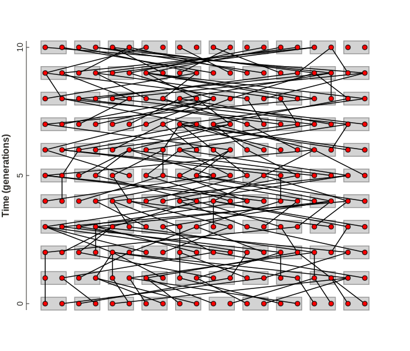
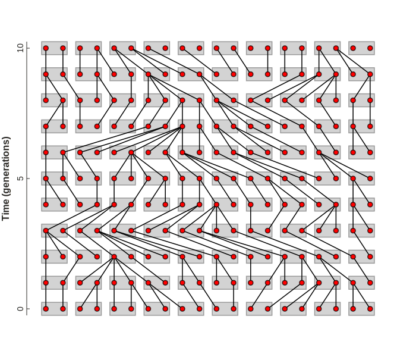
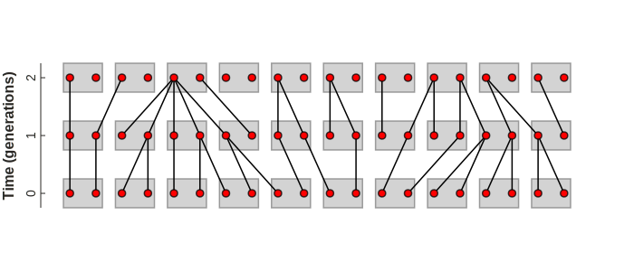
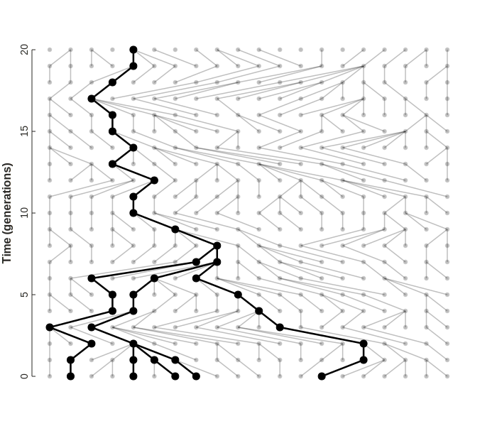

---
---

# Wright-Fisher

## Learning objectives
By the end of this lesson you will be familiar with:

1. The Wright-Fisher (WF) process model.
2. Assumptions underlying this model.
3. calculating the probability two gene copies share a parent.
4. extensions of this probabilistic thinking to studying genealogies.


## Wright-Fisher Process
The Wright-Fisher process is considered one of the simplest models in 
population genetics. Compared to an idealized population, in which 
allele frequencies are always in HW equilibrium, and do not change, 
the WF process by default relaxes at least one assumption: population 
sizes are not infinite.

The introduction of finite population sizes allows for allele frequencies
to change over time, as genetic drift will cause an allele to randomly 
become either entirely fixed, or lost with the rate of fixation being a 
function of the population size. In this lesson we will write code to 
simulate and visualize a population evolving under a WF process, and to
understand how population size affects not only the rate of genetic drift,
but also the genealogical relationships among samples, and ultimately,
the concept that these two results are linked.
Before we proceed, however, it is important to discuss some terminology.

## Effective population size
One of the most challenging concepts in population genetics is that of 
*effective population size* ($N_e$). This is not to be confused with
the population census size, which is the number of individuals in a 
population. 

The concept of effective population size was first developed by Sewall 
Wright (1931, 1933) as a metric for describing the rate of genetic drift,
or inbreeding. Specifically, it was developed in reference to populations
evolving under a WF process, where an idealized population will 
experience changes in allele frequencies over time due to only a single
evolutionary force, genetic drift caused by a finite population size ($N_e$). 

The effective population is usually smaller than the actual population 
census size, representing the effects of deviations from the assumptions 
of an idealized population. In the WF process model, it is easy to 
interpret $N_e$, since it is equivalent to the census population size, 
N. However, in more complex models, and especially in real populations, 
$N_e$ becomes a summary statistic for the impacts of many possible 
evolutionary processes that violate the assumptions of an idealized 
population, causing genetic drift and inbreeding at higher rates
than would occur in a population of the same size if it were an idealized
population. 

For example, an idealized population of census size N=10,000 will have 
an effective population size of $N_e$=10,000. By contrast, a different 
population of census size N=10,000 that experiences non-random mating
may have an effective population size of $N_e$=6,000. This value can be
interpreted to mean that the second population will experience genetic
drift at the same rate as an idealized population of size N=6,000, even
though it in fact contains 10,000 individuals.

<!-- 
Because in the standard WF process the only way in which it differs from
an idealized population is by having a finite population size, the WF process
provides a convenient way to study the effects of $N_e$, since in this case, 
and this case alone, $N_e$ will be equal to the population census size. 
Thus, we can examine how raising or lowering $N_e$ affects the rate of 
fixation of alleles.  -->

[Review papers] continue to be written on the subject of $N_e$, and how it 
should be interpreted, and the development of methods for measuring $N_e$ 
as a descriptor of evolution remain at the forefront of population genetics.
Recent work includes methods for examining $N_e$ as a variable metric 
spatially across regions of genomes in a population, as well as for 
estimating changes in $N_e$ through time. As we will see, there are 
also alternative statistical approaches for describing $N_e$ based on 
probabilities of coalescence, which we will discuss in the next lesson.

[Review papers]: https://www.nature.com/articles/hdy201643. 


## Visualizing the WF process
To help understand WF models and their connection to genealogies it is
helpful to visualize stochastic outcomes of a WF process. The following
visualizations are created using `toyplot`, and you can learn more about
the visualization code in the next [code lesson]. Here we will simply use
the `WrightFisherPlot` class from the dropdown below to generate and draw
WF process outcomes. This takes a `seed` parameter for a random number
generator to produce different outcomes. 

??? example "WF process visualization code using toyplot"
	
	```py
	from typing import Optional, Dict, List, Union
	import numpy as np
	import toyplot

	class WrightFisherPlot:
	    def __init__(self, time=20, popsize=20, width: int=500, height: int=500, seed: Optional[int]=None):
	        self.rng: np.random.Generator = np.random.default_rng(seed)
	        self.grid: np.ndarray = np.arange(popsize * 2 * time).reshape((time, popsize * 2))
	        self.edges: np.ndarray = None
	        self.canvas: toyplot.Canvas = toyplot.Canvas(width=width, height=height)
	        self.axes: toyplot.coordinates.Cartesian = None
	        self._setup_axes()
	        self.marks: Dict[str, 'toyplot.Mark'] = {}

	        # get node coordinates
	        ys, xs = np.where(self.grid > -1)
	        self.coords = np.column_stack([xs, ys])

	    def _setup_axes(self):
	        # setup the canvas and axes
	        self.axes = self.canvas.cartesian(xshow=False, ylabel="Time (generations)", margin=70, padding=25)
	        self.axes.y.ticks.labels.style["font-size"] = 14
	        self.axes.y.label.style["font-size"] = 16
	        self.axes.y.label.offset = 30
	        self.axes.y.ticks.locator = toyplot.locator.Extended()
	        self.axes.y.ticks.show = True
	        
	    def add_haploids(self, **kwargs):
	        """Add circle marks for gene copies."""
	        style = {
	            "marker": "o", 
	            "color": "white", #toyplot.color.Palette()[1]
	            "size": self.canvas.width / self.grid.shape[1] / 7.5,
	            "mstyle": {"stroke": "black", "stroke-opacity": 0.75, "stroke-width": 1.5},
	        }
	        style.update(kwargs)
	        self.marks['haploids'] = self.axes.scatterplot(
	            self.coords[:, 0], self.coords[:, 1], 
	            **style,
	        );

	    def add_diploids(self):
	        """Adds a rectangle around pairs of gene copies to represent a diploid individual."""
	        self.marks['diploids'] = self.axes.rectangle(
	            self.coords[:, 0][::2] - 0.25,
	            self.coords[:, 0][::2] + 1.25, 
	            self.coords[:, 1][::2] - 0.25,
	            self.coords[:, 1][::2] + 0.25,
	            style={"fill": "lightgrey", "stroke": "grey", "stroke-opacity": 0.75, "stroke-width": 1.5},
	        );
	        
	    def add_lines(self, sort: bool=True, **kwargs):
	        """Adds lines from gene copies to randomly sampled parent gene copies each generation.
	        """
	        # iterate over each generation adding pairs of node indices
	        for gen in range(0, self.grid.shape[0] - 1):
	            # children idxs span from left to right
	            lower_idxs = self.grid[gen]

	            # randomly sample parent idxs (some have many children, some none)
	            upper_idxs = self.rng.choice(self.grid[gen + 1], size=self.grid[gen + 1].size, replace=True)
	            
	            # get sorting index for the upper idxs
	            if sort:
	                order = np.argsort(upper_idxs)
	            else:
	                order = np.arange(upper_idxs.size)
	                
	            # update array of edges
	            iedges = np.column_stack([lower_idxs, upper_idxs[order]])
	            if self.edges is not None:
	                self.edges = np.concatenate([self.edges, iedges])
	            else:
	                self.edges = iedges

	        # style the graph
	        style = {"vlshow": False, "ecolor": "black", "ewidth": 1.5, 'vsize': 0, 'estyle': {}}
	        style.update(kwargs)

	        # add graph lines from lower_idxs to upper_idxs, using coordinates for all
	        self.marks['genealogy'] = self.axes.graph(
	            self.edges,
	            vcoordinates=self.coords[sorted(np.unique(self.edges))],
	            **style,
	        );
	        
	    def add_sampled_lines(self, samples: Union[int, List[int]], **kwargs):
	        """Add sampled genealogy lines from N random samples, or a list of sampled indices."""   
	        if isinstance(samples, int):
	            nsample = min(samples, self.grid.shape[0])
	            samples = list(self.rng.choice(self.grid[0], size=samples, replace=False))          
	        
	        # base styles for the graph
	        style = {"vlshow": False, "ecolor": toyplot.color.Palette()[0], "ewidth": 2, 'vsize': 0, 'estyle': {}}
	        style.update(kwargs)
	            
	        # get selected edges to show
	        tracked = samples.copy()
	        for e in self.edges:
	            if e[0] in tracked:
	                tracked.append(e[1])

	        # subset the edges to graph
	        mask = np.isin(self.edges[:, 0], tracked)
	        edges = self.edges[mask]
	        
	        # apply unique color to coalescent events
	        if 'vcolor' not in style:
	            vcolors = []
	            vmarkers = []
	            for v in sorted(np.unique(edges)):
	                if sum(edges[:, 1] == v) > 1:
	                    vcolors.append('yellow')
	                    vmarkers.append("s")
	                else:
	                    vcolors.append('black')
	                    vmarkers.append("o")
	            style.update({
	                'vcolor': vcolors,
	                'vstyle': {'stroke': 'black', 'stroke-width': 2},
	                'vmarker': vmarkers,
	            })
	        
	        # add graph lines from lower_idxs to upper_idxs, using coordinates for all
	        self.marks['genealogy'] = self.axes.graph(
	            edges,
	            vcoordinates=self.coords[sorted(np.unique(edges))],
	            **style,
	        );
	```


### Simulating WF process

A WF process can be simulated quite easily. It is a discrete-time process
where each generation 2N haploid gene copies exist in a population of 
census size N. Because the population is assumed to be randomly mating
we can randomly assign haploid gene copies to be grouped into diploid 
individuals. This grouping has no effect on how the model operates 
unless some other model assumptions were to be relaxed, and is thus only
for visualization purposes. To simulate one generation of the WF process 
one needs only to create a new generation of 2N haploid copies and to 
randomly 2N copies, with replacement, from the previous generation
to serve as their parents. 

The result of this random mating process, played out over multiple 
generations, looks like the plot below. The process gives rise to a 
genealogy of gene copies. Lines are drawn to connect gene copies in each
generation from parent to offspring. Grey rectangles represent diploid 
individuals, which contain two gene copies, represented by red circles.

```py
# example WF plot
wf = WrightFisherPlot(seed=123, time=11, popsize=10, width=700, height=500)
wf.add_diploids()
wf.add_lines(sort=False)
wf.add_haploids(color="red", size=8)
```

<figure markdown>
  {width="700", loading=lazy}
  <figcaption>Fig. 2.2.0. Wright-Fisher process.</figcaption>
</figure>

### Interpreting WF genealogies
This process is much easier to comprehend when the edges are sorted so that
they are easier to read. Remember, however, that regardless of this sorting
for visualization purposes, that the parents of gene copies are still being
randomly sampled each generation. Time in this model flows from top to bottom,
such that the gene copies at time=0 represent the present, and the ancestors
of these gene copies, as well as other gene copies that did not leave 
descendants, exist in past generations (gens 1 - 11 in this visualization).


```py
# example WF plot with sorted edges for visualization
wf = WrightFisherPlot(seed=123, time=11, popsize=10, width=700, height=500)
wf.add_diploids()
wf.add_lines(sort=True)
wf.add_haploids(color="red", size=8)
```

<figure markdown>
  {width="700", loading=lazy}
  <figcaption>Fig. 2.2.1. WF process with edges sorted for visualization.</figcaption>
</figure>

Understanding the flow of time in these diagrams is very important, and 
can sometimes be challenging, since different authors may present the same
type of figure flowing top to bottom, or bottom to top. Fortunately, there
is a simple trick to easily identify the flow of time, which is to identify
the *direction in which every node has an edge flowing*. That direction will
be backwards in time. This is because **every gene copy has an ancestor, 
but not every gene copy will leave descendants**. The latter outcome is 
a consequence of genetic drift, where a random sampling process will cause
some gene copies to leave multiple descendants, while others will leave none.

The plot below zooms in on just the final three generations of a WF process
simulation. You can see that every gene copy has an edge pointing up
(backwards in time), but many gene copies do not have an edge pointing down.

As we said earlier, mating occurs randomly in this model, without regard to
the way in which gene copies are grouped inside of diploid individuals. 
Consequently, it is possible for odd mating strategies to occur, such as 
selfing, which is a case where a diploid individual produces an offspring
genetically identical to itself. In the figure below, generated with the
random seed 123, look at the first two individuals from the left in generation
0. The first inherits the same two gene copies that were present in an 
individual in the previous generation. The second inherits two copies of 
a single gene copy that was present in an individual in the previous 
generation. The first is a representation of diploid selfing, and the 
second a form of haploid selfing. Although this represents a form of 
inbreeding, it is the expected level of inbreeding in a population of this
effective population size, since it was generated by random mating. A 
non-random mating strategy, by contrast, may lead to more or less inbreeding
than this expectation, by perhaps preventing selfing, or incorporating 
behavior or geography into mating. The simple WF process thus provides a 
null expectation against which to compare.

```py
# example WF plot with sorted edges for visualization
wf = WrightFisherPlot(seed=123, time=3, popsize=10, width=700, height=300)
wf.add_diploids()
wf.add_lines(sort=True)
wf.add_haploids(color="red", size=8)
```

<figure markdown>
  {width="700", loading=lazy}
  <!-- <figcaption>An example phylogenetic tree drawing.</figcaption> -->
</figure>


## Genealogy of samples
A consequence of this simple discrete random sampling process, repeated 
over multiple generations, is that any gene copy that exists at the 
present can trace back a tree-like genealogical history with any other 
gene copy at the present. As an example, we can randomly sample 5 gene 
copies at the present and focus on their individual ancestries. As we 
can see, they each trace back some number of generations before they 
eventually share a common ancestor; an ancestral gene copy from which 
they are all descended. 

This is demonstrated below. Here we sample 6 gene copies in total, coming
from 3 diploid individuals (which we'll refer to as individuals 1, 2, and 3, 
from left to right), which are shown in bold compared to unsampled gene 
copies and their ancestors. The common ancestors of sampled gene copies
are highlighted as yellow squares. All of the 6 gene copies that we sampled
in this scenario coalesce into a single common ancestor gene copy at 
time=16 (16 generation back from the present). The two gene copies in 
individuals 1 and 3 each share a MRCA just one generation back from the
present. However, the two gene copies in individual 2 do not share a 
common ancestor until generation 12. In fact, one of the gene copies
from this individual coalesces with the common ancestor of the gene copies
of individual 1 long before it coalesces with the other gene copy present
in the same individual.

```py
# example WF plot with sampled tips genealogy
wf = WrightFisherPlot(seed=444, time=21, popsize=10, width=700, height=600)
wf.add_diploids()
wf.add_lines(sort=True, eopacity=0.25)
wf.add_sampled_lines(samples=[0, 1, 10, 11, 18, 19], ecolor="black", ewidth=2.5, vsize=10)
wf.add_haploids(color="black", size=5, opacity=0.25)
```

<figure markdown>
  {width="700", loading=lazy}
  <figcaption>Fig. 2.2.3 Coalescence in a WF process.</figcaption>
</figure>


## Coalescence

Sewall Wright noted that in a finite population evolving under a WF process
the probability that two random gene copies will share a common ancestor 
in the previous generation is `1/2N`, since there are 2N gene copies in 
the population. This type of event, where two descendant gene copies merge
into a common ancestor, when viewed backwards in time, is termed a 
*coalescence*. It turns that this view of population histories, in the form
of probabilistic statements about common ancestry, can be a very powerful
way to describe evolution in populations. In fact, an entire
statistical framework has been developed to study populations based on
probabilistic expectations for the time and its variance until 
some number of samples coalesce, called Coalescent Theory. This is the 
subject of the next lesson.


## Summary

1. A Wright-Fisher process, or model, is a discrete-time process of 
reproduction in an idealized population of finite size over multiple
generations.
2. Interpreting a WF-process plot requires understanding the direction 
of time, and which gene copies are ancestors or descendants of others.
3. The WF process gives rise to genealogical relationships among gene
copies. 
4. All gene copies in a population will eventually coalescent to a common
ancestor. 
5. The probability that two gene copies share a common ancestor 1 generation
ago is `1 / 2Ne`.
