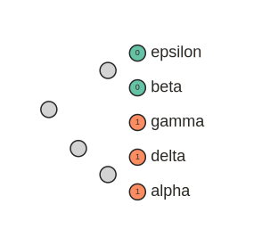
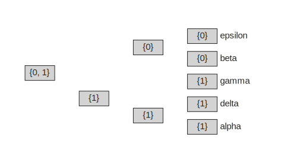
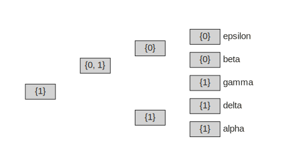
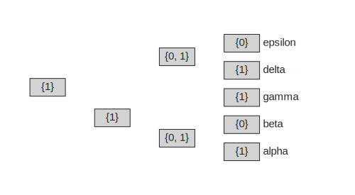

---
---


# Tree Inference (Parsimony) (TO BE UPDATED)

:material-star: *Follow along in a binder jupyter notebook:*
[:material-notebook: fitch-parsimony.ipynb](https://mybinder.org/v2/gh/eaton-lab/phylogenetic-data-science/HEAD?filepath=docs%2Fchapter-6%2Fnotebooks%2Fparsimony.ipynb)

## Learning objectives
<!-- Before starting this chapter I recommend reading [chapter 5](../6.0-tree-inference.md) for an introduction to phylogenetic inference.  -->
By the end of this chapter you will:

1. Understand how the principle of parsimony is used in phylogenetic tree inference.
2. Be able to write a function to calculate a parsimony score.
3. Know the difference between Fitch and Sankoff parsimony algorithms.


## The principle of parsimony
The principle of parsimony, also termed [*Occam's razor*], is widely used in
biology. It advocates that when presented with competing hypotheses about the 
same prediction -- such as different phylogenetic hypotheses for a set of 
samples -- one should select the solution that requires the fewest 
assumptions. In evolutionary terms, this is often interpreted to mean that 
the most *parsimonious* solution is the one that requires the fewest 
observed evolutionary changes/events.

[*Occam's razor*]: https://en.wikipedia.org/wiki/Occam's_razor


## Maximum parsimony
Finding the most parsimonious tree given a phylogenetic dataset thus 
requires, most importantly, an algorithm for counting the number of 
evolutionary changes on a phylogenetic tree. This turns out to be 
relatively simple to code algorithmically, but can be quite complex in
terms of the underlying philosophical and statistical interpretations
of what these changes mean. A subject we will return to later. In this
chapter we will learn algorithmic methods for *counting evolutionary changes*, 
by introducing two algorithms, *Fitch parsimony* and *Sankoff parsimony*.

The number of evolutionary changes that must occur on a tree, given a 
dataset of character states at the tips, can be referred to as its 
*parsimony score*. Given a method for computing parsimony scores, one could
in theory apply it to every possible tree topology to N taxa to find the
one or more trees that require the minimum number of changes. Because the
total number of possible trees is typically far too large to compute on, 
[heuristic search] methods are employed instead, which score only a subset 
of trees. This general approach, of comparing parsimony scores 
on many trees to find the best scoring tree is termed *maximum parsimony (MP)*.

[heuristic search]: .

## Parsimony for teaching evolution
Because parsimony is simple, it is frequently used in introductory evolution
textbooks, and other resources, to show evidence for evolution without the
need for describing more complex statistical models. For example, we could
compare two hypotheses for the evolution of relationships among vertebrate
lineages using a number of discrete character traits to show that one tree
requires more evolutionary events than the other. In hypothesis 1 the 
evolution of a *bony skeleton* is inferred to have occurred only once, 
whereas in hypothesis 2 it is inferred to have evolved twice independently.
<!-- A convergent evolutionary pattern that called *homoplasy*.  -->


- ==add textbook style images here of two trees with apomorphies, one with homoplasy.==

### Phylogenetic data
As with most phylogenetic inference algorithms, parsimony is intended to 
apply to discrete character measurements, such as binary data 
(`0` or `1`) or multistate characters (e.g., `A`, `B`, `C` or `D`). We discuss
discrete data in much detail in [chapter 3]. Parsimony can be applied to DNA
sequence data, and is frequently used alongside other methods for analyzing
DNA, such as likelihood and distance-based inference methods. However,
the *niche* where maximum parsimony remains most commonly used today, is in 
the analysis of morphological datasets, especially in paleontology,
where DNA sequence data is often not available.

- ==describe assumptions about traits used in the image above, such as 
the number of possible states.==
- ==describe that there is active debate about the continued value of 
morphological data for *inferring trees*, as opposed to just being studied
on trees inferred with other data. Link to readings.==

[chapter 3]: . 

### Characters on a tree
Let's start with a simple example where we have measured a single
discrete binary character for five different species, and we want to 
examine this character with respect to a particular phylogenetic 
hypothesis. We will make the assumption that the character can only be in
one of two possible states, and thus that the only possible evolutionary
changes are from `0 -> 1` or `1 -> 0`. We only have data for the tip
samples, but from these data we can infer the minimum number of 
evolutionary changes that must occur, given a tree, for the character states
to be distributed among tips in the way that they are. 

```py
import toytree

# an example five tip tree (with tip names alpha-epsilon)
tree = toytree.tree("(((alpha,delta),gamma),(beta,epsilon));")

# a single binary trait character state for each species
trait = {
    "alpha": 1,
    "beta": 0,
    "delta": 1,
    "epsilon": 0,
    "gamma": 1,
}
```

We can easily visualize this trait in `toytree` by setting it as an attribute
of the Nodes, for example by using the `set_node_data` ToyTree function. In 
this example we store the trait as a feature named `trait`. We can then get 
and show the data for this feature in a dataframe using `get_node_data`. 
This dataframe shows node `idx` labels in the row index, and the values for
each selected Node feature (here `name` and `trait`). As we can see in this
table, and in the plots below, there are four internal Nodes that do not
have a name or trait values assigned.

```py
# sets a .trait attribute to each Node in trait dictionary
tree.set_node_data(
    feature="trait",
    mapping=trait,
    inplace=True,
)

# get and display the Node data as a dataframe
tree.get_node_data(['name', 'trait'])
```

<figure markdown>
|    | name    | trait       |
|:---|:--------|:------------|
|  0 | alpha   | 1           |
|  1 | delta   | 1           |
|  2 | gamma   | 1           |
|  3 | beta    | 0           |
|  4 | epsilon | 0           |
|  5 |         |             |
|  6 |         |             |
|  7 |         |             |
|  8 |         |             |
</figure>

Our current knowledge is only of the data at the tips, which looks like
this on our tree hypothesis:

```py 
# draw tree with tip Nodes colored by feature 'trait' 
tree.draw(
    tree_style='s',
    use_edge_lengths=False, 
    tip_labels_style={"font-size": 18},
    node_labels="trait",
    node_colors=[
        toytree.color.COLORS1[i] if i !="" else "lightgrey" 
        for i in tree.get_node_data("trait")
    ],
);
```

<figure markdown>
  {width="305", loading=lazy}
  <figcaption>Fig. 6.1</figcaption>
</figure>


### Reconstruction by eye
Given that this is a fairly small tree, we can try to estimate 
the number of evolutionary changes by eye, by counting the number
of events that would be required to explain the data at the tips. This is 
similar to what was done in the vertebrate tree example above.
Try doing this now. 

You should find that the minimum number of changes to explain this data is 1.
Depending on where that change occurred in the past, there are two equally
good reconstructions for this character on this tree topology. Either the 
root state was `1` and transitioned to `0` in the common ancestor of 
(*beta, epsilon*); or, the root state `0` and transitioned to `1` in the 
common ancestor of (*alpha, delta, gamma*).

<figure markdown>
  {width="600", loading=lazy}
  <figcaption>Fig. 6.2</figcaption>
</figure>


## Fitch algorithm

- description of Fitch...

- set intersection

- set union

Like we have done before, we will begin with a very simple implementation
of the Fitch algorithm for computing parsimony scores, and build to a 
more complex version. This is intended both to demonstrate how the algorithm
works as clearly as possible, as well as to demonstrate some common coding
practices that will be helpful for coding similar algorithms. 

```py
from typing import Dict, Any

def fitch_parsimony_single(tree: toytree.ToyTree, trait: Dict[str,Any]) -> int:
    """Return Fitch parsimony score given a tree and single trait.

    For didactic purposes this function will also store a feature named 
    'fitch' to every Node which can be examined/visualized afterwards.
    
    Parameters
    ----------
    tree: ToyTree
        A tree on which to count state changes.
    trait: Dict
        A dict mapping tip names to a single discrete character state.
        
    Returns
    -------
    int
        The minimum changes required for trait data to evolve on this tree.
    """
    # counter to keep track of change events
    nchanges = 0

    # iterate over Nodes in idxorder (postorder sorted) traversal
    for node in tree:

        # leaves are visited first, and converted to a set type
        if node.is_leaf():
            node.fitch = set(trait[node.name])

        # internal Nodes examine the sets of their children's states
        if not node.is_leaf():

            # check for shared (intersecting) states
            shared = set.intersection(*(i.fitch for i in node.children))

            # if any states are shared then ancestor inherits this state
            if shared:
                node.fitch = shared

            # if none shared, then store the union and increment counter
            else:
                node.fitch = set.union(*(i.fitch for i in node.children))
                nchanges += 1
    return nchanges
```

Applying this function to our example trait dataset returns a score of 1, 
just as we expected from examining the tree above. 
```py
fitch_parsimony_single(tree, trait)
```
```py
# 1
```

Because our function was coded to also record the set of states at each
Node during the tree traversal, we can visualize this after running the
function to ensure that it performed as we expected. This data was stored
to a feature named "fitch" on each Node, and so we can extract it easily
with `toytree` by entering this feature name to the `node_labels` draw
argument.

```py
# draw tree to show Fitch parsimony sets at each Node as rectangle markers.
tree.draw(
    width=500, 
    use_edge_lengths=False,
    node_sizes=25, 
    node_markers='r2x1',
    node_mask=False,
    node_colors="lightgrey",
    node_labels="fitch", 
    node_labels_style={'font-size': 15},
    tip_labels_style={'font-size': 15, '-toyplot-anchor-shift': 30}
);
```

<figure markdown>
  {width="500", loading=lazy}
  <figcaption>Fig. 6.3</figcaption>
</figure>


### Effect of Rooting

As mentioned earlier, although this algorithm is applied in a postorder 
traversal (from tips to the root), it does not actually rely on information
about the rooting to count the number of changes. In fact, we could 
arbitrarily root the tree on any edge and it would return the same score. 
Let's verify this now by re-rooting the tree on each possible edge and 
printing the Fitch parsimony score.

```py
# iterate over each edge that can become new root
for node in tree:
    if not node.is_root():
        # get a copy of tree rooted on new edge (selected by Node below)
        new_rooted_tree = tree.root(node)

        # print the parsimony score of this new tree
        score = fitch_parsimony_single(new_rooted_tree, trait)
        clade = node.get_leaf_names()
        print(f'score={score} when rooted on {clade}')
```

```py
# score=1 when rooted on ['alpha']
# score=1 when rooted on ['delta']
# score=1 when rooted on ['gamma']
# score=1 when rooted on ['beta']
# score=1 when rooted on ['epsilon']
# score=1 when rooted on ['alpha', 'delta']
# score=1 when rooted on ['alpha', 'delta', 'gamma']
# score=1 when rooted on ['beta', 'epsilon']
```

Once again we can visualize the sets of one of these re-rooted trees to 
see that regardless of the rooting, this tree still requires a minimum 
of only one event to explain the data at the tips.

```py
# root original tree on edge above (alpha, delta)
new_rooted_tree = tree.root('alpha', 'delta')

# get Fitch set reconstruction on Nodes
fitch_parsimony_single(new_rooted_tree, trait)

# draw the tree to show Node sets
new_rooted_tree.draw(
    width=500, 
    use_edge_lengths=False,
    node_sizes=25, 
    node_markers='r2x1',
    node_mask=False,
    node_colors="lightgrey",
    node_labels="fitch", 
    node_labels_style={'font-size': 15},
    tip_labels_style={'font-size': 15, '-toyplot-anchor-shift': 30}
);
```

<figure markdown>
  {width="500", loading=lazy}
  <figcaption>Fig. 6.4</figcaption>
</figure>


### Alternate Trees

When applied to alternative tree hypotheses the parsimony score may be 
higher or lower depending on their fit to the data. The example below
has a higher Fitch parsimony score (worse fit to the data). 

```py
# get an alternate tree topology
tree2 = toytree.tree("(((alpha,beta),gamma),(delta,epsilon));")

# print the fitch score
score = fitch_parsimony_single(tree2, trait)
print(f"score={score}")

# draw the tree showing sets on the Node labels.
tree2.draw(
    width=500, 
    use_edge_lengths=False,
    node_sizes=25, 
    node_markers='r2x1',
    node_mask=False,
    node_colors="lightgrey",
    node_labels="fitch", 
    node_labels_style={'font-size': 15},
    tip_labels_style={'font-size': 15, '-toyplot-anchor-shift': 30}
)
```
```py
# score=2
```

<figure markdown>
  {width="500", loading=lazy}
  <figcaption>Fig. 6.5</figcaption>
</figure>


## Summary
...