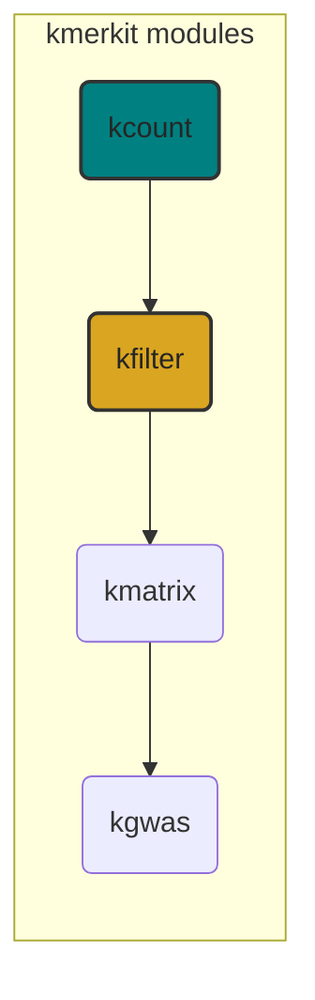

### Workflow diagram

```mermaid
%%{init: {'theme': 'base', 'themeVariables': { 'primaryColor': 'grey', 'titleColor': '#262626', 'background': green}}}%%
graph LR
	A(kcount)
	B(kfilter)
	C(kmatrix)
	D(kgwas)
	subgraph kmerkit modules
		A --> B --> C --> D
	end
	style A fill:teal,stroke:#333,stroke-width:2px,color:#262626
	style B fill:goldenrod,stroke:#333,stroke-width:2px,color:#262626
```

### Study description

Explain and cite Arabidopsis studies here...

### ...