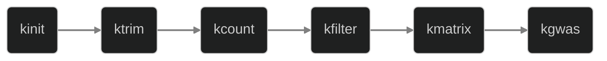

## Workflow diagram



## Study description

Here we re-implement the study by Eaton et al. (in prep) to detect 
genomic loci associated with a novel floral trait in the plant species complex
*Pedicularis cranolopha*. This study uses single-end **RAD-seq** data 
to sequence 100 individuals from 18 populations which vary in presence/absence
of the trait of interest in a way that is discordant with the phylogeny.

<cite>Citation in future</a></cite>


## Fetch fastq data
If you wish to follow along you can dowload the data from SRA with the
instructions below. 

??? abstract "Download fastq data using sra-tools"

    Download the latest version of the sratools from [https://github.com/ncbi/sra-tools/wiki/01.-Downloading-SRA-Toolkit](https://github.com/ncbi/sra-tools/wiki/01.-
    Downloading-SRA-Toolkit) by selecting the compiled binaries that are 
    appropriate for your system (e.g., Linux or MacOSX). (I really do 
    recommend that you use the latest version since this software is updated
    frequently and does not maintain compatibility with older versions.)
    Run the command below to download the fastq data for this study 
    into a new directory.

    ```bash
    # make a directory to store the raw fastq data files
    mkdir -p ./fastq-data

    # download files to the specified fastq directory
    for run in ERR4161581 ERR4161582 ERR4161583 ERR4161584; do
        fasterq-dump --progress --outdir ./fastq-data --temp . $run;
    done
    ```


## Kmerkit analysis
### Initialize a new project
We start by initing a new project to assign samples names to files. The data
are single-end

```bash
kmerkit init --name forked --workdir /tmp --delim "_" ./fastq-data/*.gz 
```

This step creates a project JSON file, which will contain the fully reproducible 
information about each step in a kmerkit analysis. This file is updated 
upon each kmerkit module that is run. This file can be read directly, 
or, you can access a more nicely formatted view of specific results by calling
`kmerkit stats` and specifying a specific module.

```bash
kmerkit stats --json /tmp/forked.json init
```

??? tip "kmerkit stats output"
	```console
	...
	```

### Read trimming (optional)
We applied read-trimming using the default options in `fastp`, but also used
the option `--subsample 2e6` to normalize the number of reads among samples
to a maximum of 2M. 

```bash
kmerkit trim --json /tmp/forked.json --workers 4
```

```bash
kmerkit stats --json /tmp/forked.json trim
```

??? tip "kmerkit stats output"
	```console
	...
	```

### Count kmers
Because RAD-seq generates data that extends directionally away from a cut-site
the resulting reads will have specific orientations. Thus, we turn off 
canonical kmer counting here to count each kmer and its reverse-complement 
as separate patterns. 

```bash
kmerkit count --json /tmp/forked.json \
	--no-canonical --kmer-size 17 --min-depth 5 --workers 4 
```

```bash
kmerkit stats --json /tmp/forked.json count
```

??? tip "kmerkit stats output"
	```console
	...
	```

### Filter kmers
Here I assign samples to either the target group (1) or the filter group (0)
and keep kmers that occur in the frequency range 0.5-1.0 in the target, and 
exclude any that occur at all (i.e., in the range 0.0-1.0) in the filter 
group. 

```bash
kmerkit filter \
	--json /tmp/forked.json \
	-1 '...' \
	-0 '...' \
	--min_map 0.0 0.5 \
	--max_map 0.0 1.0  
```

```bash
kmerkit stats -j /tmp/dioecy.json filter
```
??? tip "kmerkit filter results"
	```console
	...
	```

### Perform GWAS
Now that we've identified a set of target kmers we will extract reads from 
fastq data files that contain these kmers. This is expected to pull out reads
mapping to male-specific regions of the <i>A. palmeri</i> genome. Here you 
can enter new fastq files to extract data from, or enter the names of samples
already in the project database, which will use the (trimmed) fastq data files
referenced in the JSON file. Here I don't enter any sample names, which 
defaults to performing extractions on all 4 samples in the database (we expect
to not recover any reads for the two female pop samples).

```bash
kmerkit gwas --json /tmp/forked.json --kinship --logistic
```

??? tip "kmerkit stats output"
	```console
	...
	```


## Reproducibility
In addition to your scripts that can be used to reproduce your analysis, the 
JSON project file contains a full record of the samples, parameters, and the
order of analysis steps that make up your analysis.

??? success "kmerkit project JSON file"
	```console
	...
	```


## TODO: Post-pipeline analysis/visualization API
The `kmerkit` Python API can be used to perform post-pipeline analyses 
in a jupyter notebook. Here we create a plot of 

```python
import kmerkit

project = kmerkit.load_json("/tmp/forked.json")
...
```

